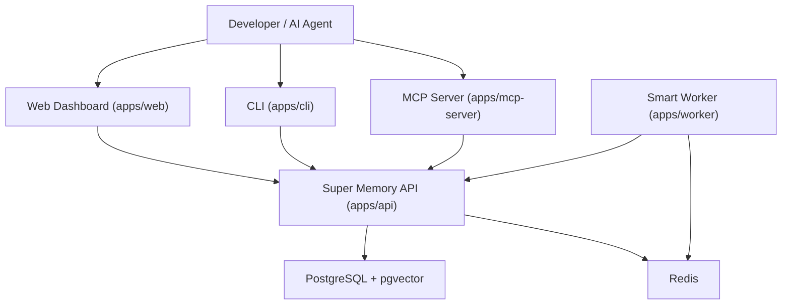
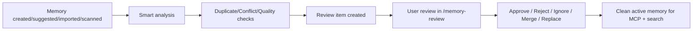

# Super Memory

Open-source, self-hosted memory infrastructure for AI coding workflows.

Super Memory gives Codex/Claude/Cursor/Windsurf a shared long-term memory layer with safe review workflows, repo scanning, and MCP integration.

## What It Solves
- Avoid repeating project context in every new AI chat.
- Store durable technical decisions, repo rules, preferences, and architecture notes.
- Keep memory quality high with duplicate/conflict/stale detection and review queues.
- Reuse the same memory across tools via API + MCP.

## Core Features

### Phase 1: Core Memory Platform
- Fastify + TypeScript API with JWT auth.
- PostgreSQL + pgvector memory store.
- Memories CRUD, archive/restore, bulk archive.
- Projects/Clients/Repos CRUD and tagging.
- Keyword/semantic-ready search.
- API keys (hashed, shown once).
- JSON import/export.
- Docker Compose local stack.

### Phase 2: MCP Integration
- `apps/mcp-server` as your own MCP package.
- API-key authenticated MCP access to Super Memory API.
- Tools:
  - `memory_search`
  - `memory_get_user_preferences`
  - `memory_get_project_context`
  - `memory_get_repo_rules`
  - `memory_get_decision_history`
  - `memory_suggest`
  - `memory_save` (guarded by mode)
- Write modes: `readonly`, `suggest`, `direct`.
- MCP audit logging in API.

### Phase 3: CLI + Repo Scanner
- `apps/cli` command: `supermemory`.
- Commands:
  - `init`, `login`, `logout`, `set-api-key`
  - `doctor`, `scan`, `push`, `pull`, `export`, `import`
- Repo scanning detects stack/rules/routes/models/env templates/docker.
- Generates pending memory suggestions + `.supermemory/context.md`.
- `/scan-results` dashboard review/apply flow.

### Phase 4: Smart Memory Engine (MVP)
- Smart analysis on memory creation.
- Duplicate detection + review items.
- Conflict detection + review items.
- Quality scoring + low-quality flags.
- Memory relation graph table.
- Memory review center UI.
- Worker scaffold (`apps/worker`) + queue foundation.

## Architecture



## Memory Lifecycle Flow



## Monorepo Structure

```txt
super-memory/
├── apps/
│   ├── api/
│   ├── web/
│   ├── mcp-server/
│   ├── cli/
│   └── worker/
├── packages/
│   └── shared/
├── docs/
├── docker-compose.yml
└── README.md
```

## Quick Start (Local)

### Prerequisites
- Node.js 20+
- npm 10+
- Docker + Docker Compose

### Setup
1. `cd /Volumes/BhavinDivecha/Projects/DevMemoryOS/super-memory`
2. `cp .env.example .env`
3. Update `.env`:
   - `JWT_SECRET`
   - `OPENAI_API_KEY` (optional)
   - `SUPER_MEMORY_API_KEY` (for MCP tests)
4. Install deps: `npm install`
5. Prisma sync:
   - `npm run db:generate -w @super-memory/api`
   - `npm run db:migrate -w @super-memory/api`
6. Start services:
   - Core stack: `docker compose up --build`
   - With worker profile: `docker compose --profile worker up --build`
   - With mcp profile: `docker compose --profile mcp up --build`

### Local URLs
- API: `http://localhost:4000`
- Web: `http://localhost:5173`
- Postgres: `localhost:5432`
- Redis: `localhost:6379`

## How to Use

### 1) Web Dashboard
1. Register/login.
2. Create Project/Client/Repo.
3. Create memories tagged to scope.
4. Search/filter memories.
5. Use `/memory-review` for smart suggestions.
6. Use `/scans` to apply scanner-generated memories.

### 2) CLI Workflow
1. `supermemory init --project "Algo Trading" --repo "algo-trading"`
2. Authenticate:
   - API key mode: `supermemory set-api-key`
   - or user mode: `supermemory login`
3. Validate setup: `supermemory doctor`
4. Scan repo: `supermemory scan . --push --pending`
5. Review/apply in dashboard `/scans`.

### 3) MCP Workflow (Codex/Claude)
1. Create API key in dashboard.
2. Configure MCP server env with that key.
3. Start MCP server.
4. In coding chat, tools can pull project context, repo rules, preferences, and decisions.

## Deploy Steps

### Option A: Single VM (Recommended first)
1. Provision Linux VM.
2. Install Docker + Docker Compose.
3. Copy project or use your published Docker images.
4. Set production `.env` values.
5. Run:
   - `docker compose up -d`
   - `docker compose --profile worker up -d`
6. Put Nginx/Caddy in front for TLS + domain routing.
7. Backup Postgres volume regularly.

### Option B: Image-Only Distribution (for users)
- Ship only Docker images + a `docker-compose.yml` + `.env.example`.
- Users configure env and run `docker compose up -d`.
- No source code required on user machine.

## Test Steps

### API + Web Smoke Test
1. Register/Login.
2. Create project/client/repo.
3. Create memory (active + pending).
4. Search memory.
5. Export JSON.
6. Import JSON.
7. Create API key.

### Smart Memory Smoke Test
1. Create two near-duplicate memories.
2. Open `/memory-review`.
3. Confirm duplicate/conflict items appear.
4. Approve/reject and verify status updates.

### CLI Smoke Test
1. `supermemory doctor`
2. `supermemory scan . --dry-run`
3. `supermemory scan . --push --pending`
4. Confirm scan appears in `/scans`.

### MCP Smoke Test
1. Set valid `SUPER_MEMORY_API_KEY`.
2. Call `memory_get_project_context` for existing project.
3. Call `memory_search` and verify relevant results.
4. Call `memory_suggest` and verify pending memory created.

## Security Notes
- Passwords are hashed.
- API keys are stored hashed and shown once.
- Data is user-isolated.
- Smart actions are review-driven, not destructive by default.
- Do not store passwords/private keys/customer-sensitive secrets.

## Useful Docs
- CLI: [`docs/phase3-cli.md`](docs/phase3-cli.md)
- MCP setup: [`docs/codex.md`](docs/codex.md), [`docs/claude-code.md`](docs/claude-code.md)
- MCP tools: [`docs/mcp-tools.md`](docs/mcp-tools.md)
- Security: [`docs/security.md`](docs/security.md)

## Support This Project
If Super Memory helps you, support development:

- Patreon: [Patreon link](https://patreon.com/bhavindivecha)

## License
Choose and add a license file (MIT/Apache-2.0 recommended for OSS).
