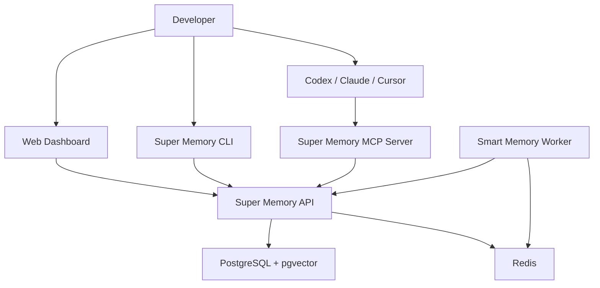
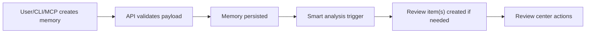
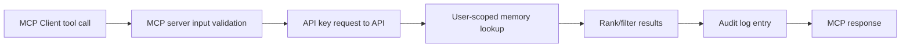
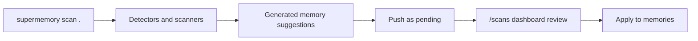

# Super Memory

Version: Phase 4 (Core + MCP + CLI Scanner + Smart Memory MVP)

Super Memory is a self-hosted memory platform for AI coding workflows. It gives you a reusable, structured, and reviewable memory layer that works across Codex, Claude Code, Cursor-compatible MCP clients, and your own tooling.

---

## Table of Contents

1. Product Overview
2. Problem Statement
3. Feature Matrix (Phase 1-4)
4. High-Level Architecture
5. Data Flow Diagrams
6. Monorepo Layout
7. Core Concepts
8. Authentication and Authorization Model
9. Database Model Reference
10. API Reference
11. MCP Server Reference
12. CLI Reference
13. Smart Memory Engine Reference
14. Frontend Guide
15. Environment Variables
16. Local Development Setup
17. Deployment Guide
18. Docker Image-Only Distribution Guide
19. Testing Guide
20. Security Guide
21. Observability and Operations
22. Performance and Scaling Notes
23. Backup and Disaster Recovery
24. Commercialization Notes
25. Support Links
26. FAQ
27. Troubleshooting Playbooks
28. Command Cheat Sheet
29. Acceptance Checklists
30. Contributing Guide
31. License

---

## 1) Product Overview

Super Memory provides a shared memory store where durable context can be saved, searched, reviewed, and reused by AI assistants during coding workflows.

It is designed to solve practical issues:
- context loss between chats
- repeated prompting overhead
- stale or conflicting implementation guidance
- lack of review control over AI-generated memory

Super Memory is intentionally local-first and self-hosted first.

---

## 2) Problem Statement

Without memory infrastructure, AI coding workflows degrade over time:
- each new session starts with less context
- repeated prompt engineering wastes time
- architecture decisions get lost
- repo-specific rules are forgotten
- conflicting memories accumulate silently

Super Memory addresses this with:
- structured memory entities
- scoping (global/project/client/repo)
- search and retrieval APIs
- MCP tools for coding agents
- scanner-based context generation
- review-first smart memory quality workflows

---

## 3) Feature Matrix

### Phase 1: Core Platform
- backend API (Fastify + TypeScript + Prisma)
- PostgreSQL with pgvector-ready schema
- memory CRUD and search
- project/client/repo tagging
- API keys
- import/export
- dashboard UI

### Phase 2: MCP Integration
- dedicated `apps/mcp-server`
- API-key-based memory access
- Codex and Claude integration docs
- read/write tool permission modes
- MCP audit logging

### Phase 3: CLI + Repo Scanner
- `supermemory` CLI commands
- repo scanning and stack detection
- generated memory suggestions
- scan results review in dashboard
- local `.supermemory/context.md`

### Phase 4: Smart Memory Engine (MVP)
- duplicate detection
- conflict detection
- quality score generation
- review queue
- memory relations
- worker queue scaffold for async jobs

---

## 4) High-Level Architecture



---

## 5) Data Flow Diagrams

### 5.1 Memory Creation Flow



### 5.2 MCP Read Flow



### 5.3 Scan-to-Memory Flow



---

## 6) Monorepo Layout

```txt
super-memory/
├── apps/
│   ├── api/
│   ├── web/
│   ├── mcp-server/
│   ├── cli/
│   └── worker/
├── packages/
│   └── shared/
├── docs/
├── docker-compose.yml
├── .env.example
└── README.md
```

---

## 7) Core Concepts

### Memory
A durable unit of reusable context.

### Scope
Domain and applicability boundary for memory.

### Status
Lifecycle state: active, pending, archived, rejected.

### Review Item
A smart-memory suggestion requiring explicit user action.

### Relation
Graph edge connecting two memories (duplicate/conflict/support/etc).

### Smart Mode
Safety-first detection and suggestion, not destructive auto-cleaning.

---

## 8) Authentication and Authorization Model

### Dashboard user auth
- JWT-based
- register/login/me/logout

### External tool auth
- API keys for CLI/MCP
- hashed storage
- key shown once at creation

### User-level isolation
Every query and action is scoped to authenticated user.

### Mixed auth support
Some API routes support `requireAuthOrApiKey` to allow CLI/MCP flows without browser JWT.

---

## 9) Database Model Reference

Current key tables:
- users
- projects
- clients
- repos
- memories
- api_keys
- mcp_audit_logs
- scan_results
- memory_review_items
- memory_relations

### Memory quality fields
- quality_score
- freshness_score
- usage_count
- last_used_at
- last_reviewed_at
- superseded_by
- version

---

## 10) API Reference

Base URL: `http://localhost:4000/api/v1`

### Response conventions
Success:
```json
{
  "success": true,
  "data": {}
}
```

Error:
```json
{
  "success": false,
  "error": {
    "code": "VALIDATION_ERROR",
    "message": "Invalid input",
    "details": {}
  }
}
```

### 10.1 Auth
- POST `/auth/register`
- POST `/auth/login`
- GET `/auth/me`
- POST `/auth/logout`

### 10.2 Projects
- POST `/projects`
- GET `/projects`
- GET `/projects/:id`
- PATCH `/projects/:id`
- DELETE `/projects/:id`
- GET `/projects/:id/memories`

### 10.3 Clients
- POST `/clients`
- GET `/clients`
- GET `/clients/:id`
- PATCH `/clients/:id`
- DELETE `/clients/:id`
- GET `/clients/:id/memories`

### 10.4 Repos
- POST `/repos`
- GET `/repos`
- GET `/repos/:id`
- PATCH `/repos/:id`
- DELETE `/repos/:id`
- GET `/repos/:id/memories`

### 10.5 Memories
- POST `/memories`
- GET `/memories`
- GET `/memories/:id`
- PATCH `/memories/:id`
- DELETE `/memories/:id` (archive semantics)
- POST `/memories/search`
- POST `/memories/bulk-delete`
- POST `/memories/:id/archive`
- POST `/memories/:id/restore`

### 10.6 API Keys
- POST `/api-keys`
- GET `/api-keys`
- DELETE `/api-keys/:id`

### 10.7 Import/Export
- GET `/export/json`
- POST `/import/json`

### 10.8 Scan Results
- POST `/scan-results`
- GET `/scan-results`
- GET `/scan-results/:id`
- POST `/scan-results/:id/apply`
- DELETE `/scan-results/:id`

### 10.9 Smart Memory
- GET `/smart-memory/health`
- POST `/smart-memory/analyze/:memoryId`
- POST `/smart-memory/detect-duplicates/:memoryId`
- POST `/smart-memory/detect-conflicts/:memoryId`
- POST `/smart-memory/score/:memoryId`
- POST `/smart-memory/merge`
- POST `/smart-memory/replace`

### 10.10 Memory Review
- GET `/memory-review-items`
- GET `/memory-review-items/:id`
- POST `/memory-review-items/:id/approve`
- POST `/memory-review-items/:id/reject`
- POST `/memory-review-items/:id/ignore`
- POST `/memory-review-items/:id/resolve`

### 10.11 Memory Relations
- GET `/memories/:id/relations`
- POST `/memories/:id/relations`
- DELETE `/memory-relations/:id`

### 10.12 MCP API endpoints used by mcp-server
- GET `/mcp/context/bootstrap`
- POST `/mcp/tools/memory-search`
- POST `/mcp/tools/user-preferences`
- POST `/mcp/tools/project-context`
- POST `/mcp/tools/repo-rules`
- POST `/mcp/tools/decision-history`
- POST `/mcp/tools/memory-suggest`
- POST `/mcp/tools/memory-save`
- POST `/mcp/audit-log`

---

## 11) MCP Server Reference

Location: `apps/mcp-server`

### Tool Permission Modes
- `readonly`
- `suggest`
- `direct`

### Recommended default
`MCP_WRITE_MODE=suggest`

### Why
- reduces accidental memory pollution
- keeps approval in dashboard
- improves trust

### Client setup docs
- `docs/codex.md`
- `docs/claude-code.md`

---

## 12) CLI Reference

Binary: `supermemory`

### Commands
- `supermemory init`
- `supermemory login`
- `supermemory logout`
- `supermemory set-api-key`
- `supermemory doctor`
- `supermemory scan [path]`
- `supermemory push`
- `supermemory pull`
- `supermemory export`
- `supermemory import`

### Common workflow
1. init
2. auth (api key or login)
3. doctor
4. scan
5. push pending
6. review/apply in UI

---

## 13) Smart Memory Engine Reference

### Goal
Keep memory useful, current, and conflict-aware.

### Behavior
- score memory quality
- detect duplicates
- detect simple conflicts
- create review items
- create relation links

### Safety principles
- no auto-delete by default
- no auto-replace by default
- review queue required for sensitive actions

---

## 14) Frontend Guide

Main routes:
- `/login`
- `/register`
- `/dashboard`
- `/memories`
- `/memory-review`
- `/scans`
- `/projects`
- `/clients`
- `/repos`
- `/settings/api-keys`
- `/settings/import-export`

### UX upgrades implemented
- consistent card-based design system
- responsive layout
- improved forms and filters
- top-level workspace header
- actionable review center

---

## 15) Environment Variables

### Core API/Web
- `NODE_ENV`
- `API_PORT`
- `WEB_PORT`
- `DATABASE_URL`
- `JWT_SECRET`
- `JWT_EXPIRES_IN`
- `API_KEY_PREFIX`
- `CORS_ORIGIN`
- `VITE_API_URL`

### Embeddings
- `EMBEDDINGS_ENABLED`
- `EMBEDDING_PROVIDER`
- `OPENAI_API_KEY`
- `EMBEDDING_MODEL`

### Redis/Worker
- `REDIS_URL`
- `SMART_MEMORY_ENABLED`
- `SMART_MEMORY_AI_ENABLED`
- `DUPLICATE_SIMILARITY_THRESHOLD`
- `POSSIBLE_DUPLICATE_THRESHOLD`
- `MEMORY_LOW_QUALITY_THRESHOLD`
- `SMART_MEMORY_AUTO_DELETE`
- `SMART_MEMORY_AUTO_MERGE`
- `SMART_MEMORY_REVIEW_REQUIRED`

### MCP
- `SUPER_MEMORY_API_URL`
- `SUPER_MEMORY_API_KEY`
- `MCP_SERVER_NAME`
- `MCP_WRITE_MODE`
- `MCP_DEFAULT_LIMIT`
- `MCP_MAX_LIMIT`
- `MCP_ENABLE_RESOURCES`
- `MCP_ENABLE_PROMPTS`
- `MCP_REDACT_SECRETS`

---

## 16) Local Development Setup

### Step-by-step
1. `cd /Volumes/BhavinDivecha/Projects/DevMemoryOS/super-memory`
2. `cp .env.example .env`
3. Fill `.env` values
4. `npm install`
5. `npm run db:generate -w @super-memory/api`
6. `npm run db:migrate -w @super-memory/api`
7. `docker compose up --build`

### Optional profiles
- Worker: `docker compose --profile worker up --build`
- MCP: `docker compose --profile mcp up --build`

### Build commands
- `npm run build -w @super-memory/api`
- `npm run build -w @super-memory/web`
- `npm run build -w @super-memory/mcp-server`
- `npm run build -w @super-memory/cli`
- `npm run build -w @super-memory/worker`

---

## 17) Deployment Guide

### 17.1 Production basics
- run behind reverse proxy with TLS
- set strong `JWT_SECRET`
- restrict DB/Redis network exposure
- persistent volume for Postgres
- regular backups

### 17.2 Minimal VM deployment
1. provision VM
2. install docker/docker compose
3. copy compose + env
4. pull images/build
5. run in detached mode
6. configure TLS proxy
7. add health checks and restart policies

### 17.3 Reverse proxy checklist
- API on `api.yourdomain.com`
- Web on `app.yourdomain.com`
- allow CORS only from app domain
- enforce HTTPS redirect

---

## 18) Docker Image-Only Distribution Guide

If users only get your image (no source):

### You provide
- published images (`api`, `web`, optional `mcp-server`, `worker`)
- compose file
- env example
- quick-start docs

### User does
1. `cp .env.example .env`
2. set DB/JWT/API config
3. `docker compose up -d`
4. open web UI and start using

### Benefit
Simple onboarding for non-developer teams.

---

## 19) Testing Guide

### 19.1 Smoke test (manual)
1. register/login
2. create project/client/repo
3. create memory
4. search memory
5. export/import JSON
6. create/revoke API key
7. scan repo and apply scan results
8. verify memory review center entries

### 19.2 MCP smoke test
1. configure API key
2. call `memory_get_user_preferences`
3. call `memory_get_project_context`
4. call `memory_search`
5. call `memory_suggest`
6. verify pending memory in dashboard

### 19.3 CLI smoke test
1. `supermemory init`
2. `supermemory set-api-key` or `supermemory login`
3. `supermemory doctor`
4. `supermemory scan . --dry-run`
5. `supermemory scan . --push --pending`
6. verify `/scans` page

### 19.4 Smart memory smoke test
1. create duplicate-like memory pair
2. check `/memory-review`
3. approve/reject test
4. verify relations created

---

## 20) Security Guide

### Must-haves
- rotate API keys
- use strong JWT secret
- avoid storing secrets in memory content
- enforce user-level ownership checks
- review pending suggestions before activation

### Threat model highlights
- API key leakage
- over-permissive CORS
- stale memory poisoning
- unreviewed auto-write behavior

### Mitigations
- hash keys
- restrictive CORS
- suggest-mode default
- review queue workflow

---

## 21) Observability and Operations

Current operational handles:
- Fastify logs
- health endpoint
- MCP audit logs table
- scan results history
- review items queue

Recommended next additions:
- structured request IDs
- metrics exporter
- alerting on error spikes
- queue backlog dashboard

---

## 22) Performance and Scaling Notes

### API
- add indexes on frequently filtered fields
- paginate memory lists
- cap search results

### DB
- tune vacuum/autovacuum
- optimize text search strategy
- enable connection pooling for scale

### Redis/Worker
- configure retry/backoff
- monitor queue latency

---

## 23) Backup and Disaster Recovery

### Backup strategy
- daily logical dump
- periodic physical snapshot
- secure offsite copy

### Recovery drill
1. restore DB dump to staging
2. validate app startup
3. run smoke tests
4. document RTO/RPO

---

## 24) Commercialization Notes

Possible monetization models:
- hosted SaaS tier
- enterprise on-prem support
- paid MCP templates and integrations
- premium workflow packs
- managed deployment and migration services

Potential paid features:
- multi-team RBAC
- advanced governance and approvals
- SSO/SAML
- observability dashboards
- policy packs and compliance exports

---

## 25) Support Links

If Super Memory helps your workflow, support development:
- Patreon: https://www.patreon.com/
- Buy Me a Coffee: https://buymeacoffee.com/

Replace with your real creator links.

---

## 26) FAQ

### Is MCP server our own package?
Yes. `apps/mcp-server` is your own package in this monorepo.

### Can users run it from only Docker images?
Yes. Provide images + compose + env docs.

### Do users need login if they use API key?
For CLI/MCP workflows, API key mode can be sufficient.

### Can Super Memory be cloud hosted?
Yes. deploy API/web/db/redis/worker on cloud infra.

### Why not connect MCP directly to Postgres?
API boundary keeps auth, validation, and reuse centralized.

---

## 27) Troubleshooting Playbooks

This section intentionally contains many practical runbooks for ops and developer support.

### 27.1) Troubleshooting Case 1

**Symptom**: Scenario 1 causes unexpected behavior in API/CLI/MCP/UI.

**Likely causes**:
- environment mismatch
- stale container image
- invalid API key or JWT
- route or scope mismatch

**Resolution steps**:
1. Verify environment values and restart services.
2. Check API health and target route.
3. Validate auth mode (JWT vs API key).
4. Confirm project/repo mappings and memory scope.
5. Re-run relevant smoke test flow.

**Verification**:
- expected route responds with success true
- UI reflects updated data after refresh
- no permission error for intended auth mode

### 27.2) Troubleshooting Case 2

**Symptom**: Scenario 2 causes unexpected behavior in API/CLI/MCP/UI.

**Likely causes**:
- environment mismatch
- stale container image
- invalid API key or JWT
- route or scope mismatch

**Resolution steps**:
1. Verify environment values and restart services.
2. Check API health and target route.
3. Validate auth mode (JWT vs API key).
4. Confirm project/repo mappings and memory scope.
5. Re-run relevant smoke test flow.

**Verification**:
- expected route responds with success true
- UI reflects updated data after refresh
- no permission error for intended auth mode

### 27.3) Troubleshooting Case 3

**Symptom**: Scenario 3 causes unexpected behavior in API/CLI/MCP/UI.

**Likely causes**:
- environment mismatch
- stale container image
- invalid API key or JWT
- route or scope mismatch

**Resolution steps**:
1. Verify environment values and restart services.
2. Check API health and target route.
3. Validate auth mode (JWT vs API key).
4. Confirm project/repo mappings and memory scope.
5. Re-run relevant smoke test flow.

**Verification**:
- expected route responds with success true
- UI reflects updated data after refresh
- no permission error for intended auth mode

### 27.4) Troubleshooting Case 4

**Symptom**: Scenario 4 causes unexpected behavior in API/CLI/MCP/UI.

**Likely causes**:
- environment mismatch
- stale container image
- invalid API key or JWT
- route or scope mismatch

**Resolution steps**:
1. Verify environment values and restart services.
2. Check API health and target route.
3. Validate auth mode (JWT vs API key).
4. Confirm project/repo mappings and memory scope.
5. Re-run relevant smoke test flow.

**Verification**:
- expected route responds with success true
- UI reflects updated data after refresh
- no permission error for intended auth mode

### 27.5) Troubleshooting Case 5

**Symptom**: Scenario 5 causes unexpected behavior in API/CLI/MCP/UI.

**Likely causes**:
- environment mismatch
- stale container image
- invalid API key or JWT
- route or scope mismatch

**Resolution steps**:
1. Verify environment values and restart services.
2. Check API health and target route.
3. Validate auth mode (JWT vs API key).
4. Confirm project/repo mappings and memory scope.
5. Re-run relevant smoke test flow.

**Verification**:
- expected route responds with success true
- UI reflects updated data after refresh
- no permission error for intended auth mode

### 27.6) Troubleshooting Case 6

**Symptom**: Scenario 6 causes unexpected behavior in API/CLI/MCP/UI.

**Likely causes**:
- environment mismatch
- stale container image
- invalid API key or JWT
- route or scope mismatch

**Resolution steps**:
1. Verify environment values and restart services.
2. Check API health and target route.
3. Validate auth mode (JWT vs API key).
4. Confirm project/repo mappings and memory scope.
5. Re-run relevant smoke test flow.

**Verification**:
- expected route responds with success true
- UI reflects updated data after refresh
- no permission error for intended auth mode

### 27.7) Troubleshooting Case 7

**Symptom**: Scenario 7 causes unexpected behavior in API/CLI/MCP/UI.

**Likely causes**:
- environment mismatch
- stale container image
- invalid API key or JWT
- route or scope mismatch

**Resolution steps**:
1. Verify environment values and restart services.
2. Check API health and target route.
3. Validate auth mode (JWT vs API key).
4. Confirm project/repo mappings and memory scope.
5. Re-run relevant smoke test flow.

**Verification**:
- expected route responds with success true
- UI reflects updated data after refresh
- no permission error for intended auth mode

### 27.8) Troubleshooting Case 8

**Symptom**: Scenario 8 causes unexpected behavior in API/CLI/MCP/UI.

**Likely causes**:
- environment mismatch
- stale container image
- invalid API key or JWT
- route or scope mismatch

**Resolution steps**:
1. Verify environment values and restart services.
2. Check API health and target route.
3. Validate auth mode (JWT vs API key).
4. Confirm project/repo mappings and memory scope.
5. Re-run relevant smoke test flow.

**Verification**:
- expected route responds with success true
- UI reflects updated data after refresh
- no permission error for intended auth mode

### 27.9) Troubleshooting Case 9

**Symptom**: Scenario 9 causes unexpected behavior in API/CLI/MCP/UI.

**Likely causes**:
- environment mismatch
- stale container image
- invalid API key or JWT
- route or scope mismatch

**Resolution steps**:
1. Verify environment values and restart services.
2. Check API health and target route.
3. Validate auth mode (JWT vs API key).
4. Confirm project/repo mappings and memory scope.
5. Re-run relevant smoke test flow.

**Verification**:
- expected route responds with success true
- UI reflects updated data after refresh
- no permission error for intended auth mode

### 27.10) Troubleshooting Case 10

**Symptom**: Scenario 10 causes unexpected behavior in API/CLI/MCP/UI.

**Likely causes**:
- environment mismatch
- stale container image
- invalid API key or JWT
- route or scope mismatch

**Resolution steps**:
1. Verify environment values and restart services.
2. Check API health and target route.
3. Validate auth mode (JWT vs API key).
4. Confirm project/repo mappings and memory scope.
5. Re-run relevant smoke test flow.

**Verification**:
- expected route responds with success true
- UI reflects updated data after refresh
- no permission error for intended auth mode

### 27.11) Troubleshooting Case 11

**Symptom**: Scenario 11 causes unexpected behavior in API/CLI/MCP/UI.

**Likely causes**:
- environment mismatch
- stale container image
- invalid API key or JWT
- route or scope mismatch

**Resolution steps**:
1. Verify environment values and restart services.
2. Check API health and target route.
3. Validate auth mode (JWT vs API key).
4. Confirm project/repo mappings and memory scope.
5. Re-run relevant smoke test flow.

**Verification**:
- expected route responds with success true
- UI reflects updated data after refresh
- no permission error for intended auth mode

### 27.12) Troubleshooting Case 12

**Symptom**: Scenario 12 causes unexpected behavior in API/CLI/MCP/UI.

**Likely causes**:
- environment mismatch
- stale container image
- invalid API key or JWT
- route or scope mismatch

**Resolution steps**:
1. Verify environment values and restart services.
2. Check API health and target route.
3. Validate auth mode (JWT vs API key).
4. Confirm project/repo mappings and memory scope.
5. Re-run relevant smoke test flow.

**Verification**:
- expected route responds with success true
- UI reflects updated data after refresh
- no permission error for intended auth mode

### 27.13) Troubleshooting Case 13

**Symptom**: Scenario 13 causes unexpected behavior in API/CLI/MCP/UI.

**Likely causes**:
- environment mismatch
- stale container image
- invalid API key or JWT
- route or scope mismatch

**Resolution steps**:
1. Verify environment values and restart services.
2. Check API health and target route.
3. Validate auth mode (JWT vs API key).
4. Confirm project/repo mappings and memory scope.
5. Re-run relevant smoke test flow.

**Verification**:
- expected route responds with success true
- UI reflects updated data after refresh
- no permission error for intended auth mode

### 27.14) Troubleshooting Case 14

**Symptom**: Scenario 14 causes unexpected behavior in API/CLI/MCP/UI.

**Likely causes**:
- environment mismatch
- stale container image
- invalid API key or JWT
- route or scope mismatch

**Resolution steps**:
1. Verify environment values and restart services.
2. Check API health and target route.
3. Validate auth mode (JWT vs API key).
4. Confirm project/repo mappings and memory scope.
5. Re-run relevant smoke test flow.

**Verification**:
- expected route responds with success true
- UI reflects updated data after refresh
- no permission error for intended auth mode

### 27.15) Troubleshooting Case 15

**Symptom**: Scenario 15 causes unexpected behavior in API/CLI/MCP/UI.

**Likely causes**:
- environment mismatch
- stale container image
- invalid API key or JWT
- route or scope mismatch

**Resolution steps**:
1. Verify environment values and restart services.
2. Check API health and target route.
3. Validate auth mode (JWT vs API key).
4. Confirm project/repo mappings and memory scope.
5. Re-run relevant smoke test flow.

**Verification**:
- expected route responds with success true
- UI reflects updated data after refresh
- no permission error for intended auth mode

### 27.16) Troubleshooting Case 16

**Symptom**: Scenario 16 causes unexpected behavior in API/CLI/MCP/UI.

**Likely causes**:
- environment mismatch
- stale container image
- invalid API key or JWT
- route or scope mismatch

**Resolution steps**:
1. Verify environment values and restart services.
2. Check API health and target route.
3. Validate auth mode (JWT vs API key).
4. Confirm project/repo mappings and memory scope.
5. Re-run relevant smoke test flow.

**Verification**:
- expected route responds with success true
- UI reflects updated data after refresh
- no permission error for intended auth mode

### 27.17) Troubleshooting Case 17

**Symptom**: Scenario 17 causes unexpected behavior in API/CLI/MCP/UI.

**Likely causes**:
- environment mismatch
- stale container image
- invalid API key or JWT
- route or scope mismatch

**Resolution steps**:
1. Verify environment values and restart services.
2. Check API health and target route.
3. Validate auth mode (JWT vs API key).
4. Confirm project/repo mappings and memory scope.
5. Re-run relevant smoke test flow.

**Verification**:
- expected route responds with success true
- UI reflects updated data after refresh
- no permission error for intended auth mode

### 27.18) Troubleshooting Case 18

**Symptom**: Scenario 18 causes unexpected behavior in API/CLI/MCP/UI.

**Likely causes**:
- environment mismatch
- stale container image
- invalid API key or JWT
- route or scope mismatch

**Resolution steps**:
1. Verify environment values and restart services.
2. Check API health and target route.
3. Validate auth mode (JWT vs API key).
4. Confirm project/repo mappings and memory scope.
5. Re-run relevant smoke test flow.

**Verification**:
- expected route responds with success true
- UI reflects updated data after refresh
- no permission error for intended auth mode

### 27.19) Troubleshooting Case 19

**Symptom**: Scenario 19 causes unexpected behavior in API/CLI/MCP/UI.

**Likely causes**:
- environment mismatch
- stale container image
- invalid API key or JWT
- route or scope mismatch

**Resolution steps**:
1. Verify environment values and restart services.
2. Check API health and target route.
3. Validate auth mode (JWT vs API key).
4. Confirm project/repo mappings and memory scope.
5. Re-run relevant smoke test flow.

**Verification**:
- expected route responds with success true
- UI reflects updated data after refresh
- no permission error for intended auth mode

### 27.20) Troubleshooting Case 20

**Symptom**: Scenario 20 causes unexpected behavior in API/CLI/MCP/UI.

**Likely causes**:
- environment mismatch
- stale container image
- invalid API key or JWT
- route or scope mismatch

**Resolution steps**:
1. Verify environment values and restart services.
2. Check API health and target route.
3. Validate auth mode (JWT vs API key).
4. Confirm project/repo mappings and memory scope.
5. Re-run relevant smoke test flow.

**Verification**:
- expected route responds with success true
- UI reflects updated data after refresh
- no permission error for intended auth mode

### 27.21) Troubleshooting Case 21

**Symptom**: Scenario 21 causes unexpected behavior in API/CLI/MCP/UI.

**Likely causes**:
- environment mismatch
- stale container image
- invalid API key or JWT
- route or scope mismatch

**Resolution steps**:
1. Verify environment values and restart services.
2. Check API health and target route.
3. Validate auth mode (JWT vs API key).
4. Confirm project/repo mappings and memory scope.
5. Re-run relevant smoke test flow.

**Verification**:
- expected route responds with success true
- UI reflects updated data after refresh
- no permission error for intended auth mode

### 27.22) Troubleshooting Case 22

**Symptom**: Scenario 22 causes unexpected behavior in API/CLI/MCP/UI.

**Likely causes**:
- environment mismatch
- stale container image
- invalid API key or JWT
- route or scope mismatch

**Resolution steps**:
1. Verify environment values and restart services.
2. Check API health and target route.
3. Validate auth mode (JWT vs API key).
4. Confirm project/repo mappings and memory scope.
5. Re-run relevant smoke test flow.

**Verification**:
- expected route responds with success true
- UI reflects updated data after refresh
- no permission error for intended auth mode

### 27.23) Troubleshooting Case 23

**Symptom**: Scenario 23 causes unexpected behavior in API/CLI/MCP/UI.

**Likely causes**:
- environment mismatch
- stale container image
- invalid API key or JWT
- route or scope mismatch

**Resolution steps**:
1. Verify environment values and restart services.
2. Check API health and target route.
3. Validate auth mode (JWT vs API key).
4. Confirm project/repo mappings and memory scope.
5. Re-run relevant smoke test flow.

**Verification**:
- expected route responds with success true
- UI reflects updated data after refresh
- no permission error for intended auth mode

### 27.24) Troubleshooting Case 24

**Symptom**: Scenario 24 causes unexpected behavior in API/CLI/MCP/UI.

**Likely causes**:
- environment mismatch
- stale container image
- invalid API key or JWT
- route or scope mismatch

**Resolution steps**:
1. Verify environment values and restart services.
2. Check API health and target route.
3. Validate auth mode (JWT vs API key).
4. Confirm project/repo mappings and memory scope.
5. Re-run relevant smoke test flow.

**Verification**:
- expected route responds with success true
- UI reflects updated data after refresh
- no permission error for intended auth mode

### 27.25) Troubleshooting Case 25

**Symptom**: Scenario 25 causes unexpected behavior in API/CLI/MCP/UI.

**Likely causes**:
- environment mismatch
- stale container image
- invalid API key or JWT
- route or scope mismatch

**Resolution steps**:
1. Verify environment values and restart services.
2. Check API health and target route.
3. Validate auth mode (JWT vs API key).
4. Confirm project/repo mappings and memory scope.
5. Re-run relevant smoke test flow.

**Verification**:
- expected route responds with success true
- UI reflects updated data after refresh
- no permission error for intended auth mode

### 27.26) Troubleshooting Case 26

**Symptom**: Scenario 26 causes unexpected behavior in API/CLI/MCP/UI.

**Likely causes**:
- environment mismatch
- stale container image
- invalid API key or JWT
- route or scope mismatch

**Resolution steps**:
1. Verify environment values and restart services.
2. Check API health and target route.
3. Validate auth mode (JWT vs API key).
4. Confirm project/repo mappings and memory scope.
5. Re-run relevant smoke test flow.

**Verification**:
- expected route responds with success true
- UI reflects updated data after refresh
- no permission error for intended auth mode

### 27.27) Troubleshooting Case 27

**Symptom**: Scenario 27 causes unexpected behavior in API/CLI/MCP/UI.

**Likely causes**:
- environment mismatch
- stale container image
- invalid API key or JWT
- route or scope mismatch

**Resolution steps**:
1. Verify environment values and restart services.
2. Check API health and target route.
3. Validate auth mode (JWT vs API key).
4. Confirm project/repo mappings and memory scope.
5. Re-run relevant smoke test flow.

**Verification**:
- expected route responds with success true
- UI reflects updated data after refresh
- no permission error for intended auth mode

### 27.28) Troubleshooting Case 28

**Symptom**: Scenario 28 causes unexpected behavior in API/CLI/MCP/UI.

**Likely causes**:
- environment mismatch
- stale container image
- invalid API key or JWT
- route or scope mismatch

**Resolution steps**:
1. Verify environment values and restart services.
2. Check API health and target route.
3. Validate auth mode (JWT vs API key).
4. Confirm project/repo mappings and memory scope.
5. Re-run relevant smoke test flow.

**Verification**:
- expected route responds with success true
- UI reflects updated data after refresh
- no permission error for intended auth mode

### 27.29) Troubleshooting Case 29

**Symptom**: Scenario 29 causes unexpected behavior in API/CLI/MCP/UI.

**Likely causes**:
- environment mismatch
- stale container image
- invalid API key or JWT
- route or scope mismatch

**Resolution steps**:
1. Verify environment values and restart services.
2. Check API health and target route.
3. Validate auth mode (JWT vs API key).
4. Confirm project/repo mappings and memory scope.
5. Re-run relevant smoke test flow.

**Verification**:
- expected route responds with success true
- UI reflects updated data after refresh
- no permission error for intended auth mode

### 27.30) Troubleshooting Case 30

**Symptom**: Scenario 30 causes unexpected behavior in API/CLI/MCP/UI.

**Likely causes**:
- environment mismatch
- stale container image
- invalid API key or JWT
- route or scope mismatch

**Resolution steps**:
1. Verify environment values and restart services.
2. Check API health and target route.
3. Validate auth mode (JWT vs API key).
4. Confirm project/repo mappings and memory scope.
5. Re-run relevant smoke test flow.

**Verification**:
- expected route responds with success true
- UI reflects updated data after refresh
- no permission error for intended auth mode

### 27.31) Troubleshooting Case 31

**Symptom**: Scenario 31 causes unexpected behavior in API/CLI/MCP/UI.

**Likely causes**:
- environment mismatch
- stale container image
- invalid API key or JWT
- route or scope mismatch

**Resolution steps**:
1. Verify environment values and restart services.
2. Check API health and target route.
3. Validate auth mode (JWT vs API key).
4. Confirm project/repo mappings and memory scope.
5. Re-run relevant smoke test flow.

**Verification**:
- expected route responds with success true
- UI reflects updated data after refresh
- no permission error for intended auth mode

### 27.32) Troubleshooting Case 32

**Symptom**: Scenario 32 causes unexpected behavior in API/CLI/MCP/UI.

**Likely causes**:
- environment mismatch
- stale container image
- invalid API key or JWT
- route or scope mismatch

**Resolution steps**:
1. Verify environment values and restart services.
2. Check API health and target route.
3. Validate auth mode (JWT vs API key).
4. Confirm project/repo mappings and memory scope.
5. Re-run relevant smoke test flow.

**Verification**:
- expected route responds with success true
- UI reflects updated data after refresh
- no permission error for intended auth mode

### 27.33) Troubleshooting Case 33

**Symptom**: Scenario 33 causes unexpected behavior in API/CLI/MCP/UI.

**Likely causes**:
- environment mismatch
- stale container image
- invalid API key or JWT
- route or scope mismatch

**Resolution steps**:
1. Verify environment values and restart services.
2. Check API health and target route.
3. Validate auth mode (JWT vs API key).
4. Confirm project/repo mappings and memory scope.
5. Re-run relevant smoke test flow.

**Verification**:
- expected route responds with success true
- UI reflects updated data after refresh
- no permission error for intended auth mode

### 27.34) Troubleshooting Case 34

**Symptom**: Scenario 34 causes unexpected behavior in API/CLI/MCP/UI.

**Likely causes**:
- environment mismatch
- stale container image
- invalid API key or JWT
- route or scope mismatch

**Resolution steps**:
1. Verify environment values and restart services.
2. Check API health and target route.
3. Validate auth mode (JWT vs API key).
4. Confirm project/repo mappings and memory scope.
5. Re-run relevant smoke test flow.

**Verification**:
- expected route responds with success true
- UI reflects updated data after refresh
- no permission error for intended auth mode

### 27.35) Troubleshooting Case 35

**Symptom**: Scenario 35 causes unexpected behavior in API/CLI/MCP/UI.

**Likely causes**:
- environment mismatch
- stale container image
- invalid API key or JWT
- route or scope mismatch

**Resolution steps**:
1. Verify environment values and restart services.
2. Check API health and target route.
3. Validate auth mode (JWT vs API key).
4. Confirm project/repo mappings and memory scope.
5. Re-run relevant smoke test flow.

**Verification**:
- expected route responds with success true
- UI reflects updated data after refresh
- no permission error for intended auth mode

### 27.36) Troubleshooting Case 36

**Symptom**: Scenario 36 causes unexpected behavior in API/CLI/MCP/UI.

**Likely causes**:
- environment mismatch
- stale container image
- invalid API key or JWT
- route or scope mismatch

**Resolution steps**:
1. Verify environment values and restart services.
2. Check API health and target route.
3. Validate auth mode (JWT vs API key).
4. Confirm project/repo mappings and memory scope.
5. Re-run relevant smoke test flow.

**Verification**:
- expected route responds with success true
- UI reflects updated data after refresh
- no permission error for intended auth mode

### 27.37) Troubleshooting Case 37

**Symptom**: Scenario 37 causes unexpected behavior in API/CLI/MCP/UI.

**Likely causes**:
- environment mismatch
- stale container image
- invalid API key or JWT
- route or scope mismatch

**Resolution steps**:
1. Verify environment values and restart services.
2. Check API health and target route.
3. Validate auth mode (JWT vs API key).
4. Confirm project/repo mappings and memory scope.
5. Re-run relevant smoke test flow.

**Verification**:
- expected route responds with success true
- UI reflects updated data after refresh
- no permission error for intended auth mode

### 27.38) Troubleshooting Case 38

**Symptom**: Scenario 38 causes unexpected behavior in API/CLI/MCP/UI.

**Likely causes**:
- environment mismatch
- stale container image
- invalid API key or JWT
- route or scope mismatch

**Resolution steps**:
1. Verify environment values and restart services.
2. Check API health and target route.
3. Validate auth mode (JWT vs API key).
4. Confirm project/repo mappings and memory scope.
5. Re-run relevant smoke test flow.

**Verification**:
- expected route responds with success true
- UI reflects updated data after refresh
- no permission error for intended auth mode

### 27.39) Troubleshooting Case 39

**Symptom**: Scenario 39 causes unexpected behavior in API/CLI/MCP/UI.

**Likely causes**:
- environment mismatch
- stale container image
- invalid API key or JWT
- route or scope mismatch

**Resolution steps**:
1. Verify environment values and restart services.
2. Check API health and target route.
3. Validate auth mode (JWT vs API key).
4. Confirm project/repo mappings and memory scope.
5. Re-run relevant smoke test flow.

**Verification**:
- expected route responds with success true
- UI reflects updated data after refresh
- no permission error for intended auth mode

### 27.40) Troubleshooting Case 40

**Symptom**: Scenario 40 causes unexpected behavior in API/CLI/MCP/UI.

**Likely causes**:
- environment mismatch
- stale container image
- invalid API key or JWT
- route or scope mismatch

**Resolution steps**:
1. Verify environment values and restart services.
2. Check API health and target route.
3. Validate auth mode (JWT vs API key).
4. Confirm project/repo mappings and memory scope.
5. Re-run relevant smoke test flow.

**Verification**:
- expected route responds with success true
- UI reflects updated data after refresh
- no permission error for intended auth mode

### 27.41) Troubleshooting Case 41

**Symptom**: Scenario 41 causes unexpected behavior in API/CLI/MCP/UI.

**Likely causes**:
- environment mismatch
- stale container image
- invalid API key or JWT
- route or scope mismatch

**Resolution steps**:
1. Verify environment values and restart services.
2. Check API health and target route.
3. Validate auth mode (JWT vs API key).
4. Confirm project/repo mappings and memory scope.
5. Re-run relevant smoke test flow.

**Verification**:
- expected route responds with success true
- UI reflects updated data after refresh
- no permission error for intended auth mode

### 27.42) Troubleshooting Case 42

**Symptom**: Scenario 42 causes unexpected behavior in API/CLI/MCP/UI.

**Likely causes**:
- environment mismatch
- stale container image
- invalid API key or JWT
- route or scope mismatch

**Resolution steps**:
1. Verify environment values and restart services.
2. Check API health and target route.
3. Validate auth mode (JWT vs API key).
4. Confirm project/repo mappings and memory scope.
5. Re-run relevant smoke test flow.

**Verification**:
- expected route responds with success true
- UI reflects updated data after refresh
- no permission error for intended auth mode

### 27.43) Troubleshooting Case 43

**Symptom**: Scenario 43 causes unexpected behavior in API/CLI/MCP/UI.

**Likely causes**:
- environment mismatch
- stale container image
- invalid API key or JWT
- route or scope mismatch

**Resolution steps**:
1. Verify environment values and restart services.
2. Check API health and target route.
3. Validate auth mode (JWT vs API key).
4. Confirm project/repo mappings and memory scope.
5. Re-run relevant smoke test flow.

**Verification**:
- expected route responds with success true
- UI reflects updated data after refresh
- no permission error for intended auth mode

### 27.44) Troubleshooting Case 44

**Symptom**: Scenario 44 causes unexpected behavior in API/CLI/MCP/UI.

**Likely causes**:
- environment mismatch
- stale container image
- invalid API key or JWT
- route or scope mismatch

**Resolution steps**:
1. Verify environment values and restart services.
2. Check API health and target route.
3. Validate auth mode (JWT vs API key).
4. Confirm project/repo mappings and memory scope.
5. Re-run relevant smoke test flow.

**Verification**:
- expected route responds with success true
- UI reflects updated data after refresh
- no permission error for intended auth mode

### 27.45) Troubleshooting Case 45

**Symptom**: Scenario 45 causes unexpected behavior in API/CLI/MCP/UI.

**Likely causes**:
- environment mismatch
- stale container image
- invalid API key or JWT
- route or scope mismatch

**Resolution steps**:
1. Verify environment values and restart services.
2. Check API health and target route.
3. Validate auth mode (JWT vs API key).
4. Confirm project/repo mappings and memory scope.
5. Re-run relevant smoke test flow.

**Verification**:
- expected route responds with success true
- UI reflects updated data after refresh
- no permission error for intended auth mode

### 27.46) Troubleshooting Case 46

**Symptom**: Scenario 46 causes unexpected behavior in API/CLI/MCP/UI.

**Likely causes**:
- environment mismatch
- stale container image
- invalid API key or JWT
- route or scope mismatch

**Resolution steps**:
1. Verify environment values and restart services.
2. Check API health and target route.
3. Validate auth mode (JWT vs API key).
4. Confirm project/repo mappings and memory scope.
5. Re-run relevant smoke test flow.

**Verification**:
- expected route responds with success true
- UI reflects updated data after refresh
- no permission error for intended auth mode

### 27.47) Troubleshooting Case 47

**Symptom**: Scenario 47 causes unexpected behavior in API/CLI/MCP/UI.

**Likely causes**:
- environment mismatch
- stale container image
- invalid API key or JWT
- route or scope mismatch

**Resolution steps**:
1. Verify environment values and restart services.
2. Check API health and target route.
3. Validate auth mode (JWT vs API key).
4. Confirm project/repo mappings and memory scope.
5. Re-run relevant smoke test flow.

**Verification**:
- expected route responds with success true
- UI reflects updated data after refresh
- no permission error for intended auth mode

### 27.48) Troubleshooting Case 48

**Symptom**: Scenario 48 causes unexpected behavior in API/CLI/MCP/UI.

**Likely causes**:
- environment mismatch
- stale container image
- invalid API key or JWT
- route or scope mismatch

**Resolution steps**:
1. Verify environment values and restart services.
2. Check API health and target route.
3. Validate auth mode (JWT vs API key).
4. Confirm project/repo mappings and memory scope.
5. Re-run relevant smoke test flow.

**Verification**:
- expected route responds with success true
- UI reflects updated data after refresh
- no permission error for intended auth mode

### 27.49) Troubleshooting Case 49

**Symptom**: Scenario 49 causes unexpected behavior in API/CLI/MCP/UI.

**Likely causes**:
- environment mismatch
- stale container image
- invalid API key or JWT
- route or scope mismatch

**Resolution steps**:
1. Verify environment values and restart services.
2. Check API health and target route.
3. Validate auth mode (JWT vs API key).
4. Confirm project/repo mappings and memory scope.
5. Re-run relevant smoke test flow.

**Verification**:
- expected route responds with success true
- UI reflects updated data after refresh
- no permission error for intended auth mode

### 27.50) Troubleshooting Case 50

**Symptom**: Scenario 50 causes unexpected behavior in API/CLI/MCP/UI.

**Likely causes**:
- environment mismatch
- stale container image
- invalid API key or JWT
- route or scope mismatch

**Resolution steps**:
1. Verify environment values and restart services.
2. Check API health and target route.
3. Validate auth mode (JWT vs API key).
4. Confirm project/repo mappings and memory scope.
5. Re-run relevant smoke test flow.

**Verification**:
- expected route responds with success true
- UI reflects updated data after refresh
- no permission error for intended auth mode

### 27.51) Troubleshooting Case 51

**Symptom**: Scenario 51 causes unexpected behavior in API/CLI/MCP/UI.

**Likely causes**:
- environment mismatch
- stale container image
- invalid API key or JWT
- route or scope mismatch

**Resolution steps**:
1. Verify environment values and restart services.
2. Check API health and target route.
3. Validate auth mode (JWT vs API key).
4. Confirm project/repo mappings and memory scope.
5. Re-run relevant smoke test flow.

**Verification**:
- expected route responds with success true
- UI reflects updated data after refresh
- no permission error for intended auth mode

### 27.52) Troubleshooting Case 52

**Symptom**: Scenario 52 causes unexpected behavior in API/CLI/MCP/UI.

**Likely causes**:
- environment mismatch
- stale container image
- invalid API key or JWT
- route or scope mismatch

**Resolution steps**:
1. Verify environment values and restart services.
2. Check API health and target route.
3. Validate auth mode (JWT vs API key).
4. Confirm project/repo mappings and memory scope.
5. Re-run relevant smoke test flow.

**Verification**:
- expected route responds with success true
- UI reflects updated data after refresh
- no permission error for intended auth mode

### 27.53) Troubleshooting Case 53

**Symptom**: Scenario 53 causes unexpected behavior in API/CLI/MCP/UI.

**Likely causes**:
- environment mismatch
- stale container image
- invalid API key or JWT
- route or scope mismatch

**Resolution steps**:
1. Verify environment values and restart services.
2. Check API health and target route.
3. Validate auth mode (JWT vs API key).
4. Confirm project/repo mappings and memory scope.
5. Re-run relevant smoke test flow.

**Verification**:
- expected route responds with success true
- UI reflects updated data after refresh
- no permission error for intended auth mode

### 27.54) Troubleshooting Case 54

**Symptom**: Scenario 54 causes unexpected behavior in API/CLI/MCP/UI.

**Likely causes**:
- environment mismatch
- stale container image
- invalid API key or JWT
- route or scope mismatch

**Resolution steps**:
1. Verify environment values and restart services.
2. Check API health and target route.
3. Validate auth mode (JWT vs API key).
4. Confirm project/repo mappings and memory scope.
5. Re-run relevant smoke test flow.

**Verification**:
- expected route responds with success true
- UI reflects updated data after refresh
- no permission error for intended auth mode

### 27.55) Troubleshooting Case 55

**Symptom**: Scenario 55 causes unexpected behavior in API/CLI/MCP/UI.

**Likely causes**:
- environment mismatch
- stale container image
- invalid API key or JWT
- route or scope mismatch

**Resolution steps**:
1. Verify environment values and restart services.
2. Check API health and target route.
3. Validate auth mode (JWT vs API key).
4. Confirm project/repo mappings and memory scope.
5. Re-run relevant smoke test flow.

**Verification**:
- expected route responds with success true
- UI reflects updated data after refresh
- no permission error for intended auth mode

### 27.56) Troubleshooting Case 56

**Symptom**: Scenario 56 causes unexpected behavior in API/CLI/MCP/UI.

**Likely causes**:
- environment mismatch
- stale container image
- invalid API key or JWT
- route or scope mismatch

**Resolution steps**:
1. Verify environment values and restart services.
2. Check API health and target route.
3. Validate auth mode (JWT vs API key).
4. Confirm project/repo mappings and memory scope.
5. Re-run relevant smoke test flow.

**Verification**:
- expected route responds with success true
- UI reflects updated data after refresh
- no permission error for intended auth mode

### 27.57) Troubleshooting Case 57

**Symptom**: Scenario 57 causes unexpected behavior in API/CLI/MCP/UI.

**Likely causes**:
- environment mismatch
- stale container image
- invalid API key or JWT
- route or scope mismatch

**Resolution steps**:
1. Verify environment values and restart services.
2. Check API health and target route.
3. Validate auth mode (JWT vs API key).
4. Confirm project/repo mappings and memory scope.
5. Re-run relevant smoke test flow.

**Verification**:
- expected route responds with success true
- UI reflects updated data after refresh
- no permission error for intended auth mode

### 27.58) Troubleshooting Case 58

**Symptom**: Scenario 58 causes unexpected behavior in API/CLI/MCP/UI.

**Likely causes**:
- environment mismatch
- stale container image
- invalid API key or JWT
- route or scope mismatch

**Resolution steps**:
1. Verify environment values and restart services.
2. Check API health and target route.
3. Validate auth mode (JWT vs API key).
4. Confirm project/repo mappings and memory scope.
5. Re-run relevant smoke test flow.

**Verification**:
- expected route responds with success true
- UI reflects updated data after refresh
- no permission error for intended auth mode

### 27.59) Troubleshooting Case 59

**Symptom**: Scenario 59 causes unexpected behavior in API/CLI/MCP/UI.

**Likely causes**:
- environment mismatch
- stale container image
- invalid API key or JWT
- route or scope mismatch

**Resolution steps**:
1. Verify environment values and restart services.
2. Check API health and target route.
3. Validate auth mode (JWT vs API key).
4. Confirm project/repo mappings and memory scope.
5. Re-run relevant smoke test flow.

**Verification**:
- expected route responds with success true
- UI reflects updated data after refresh
- no permission error for intended auth mode

### 27.60) Troubleshooting Case 60

**Symptom**: Scenario 60 causes unexpected behavior in API/CLI/MCP/UI.

**Likely causes**:
- environment mismatch
- stale container image
- invalid API key or JWT
- route or scope mismatch

**Resolution steps**:
1. Verify environment values and restart services.
2. Check API health and target route.
3. Validate auth mode (JWT vs API key).
4. Confirm project/repo mappings and memory scope.
5. Re-run relevant smoke test flow.

**Verification**:
- expected route responds with success true
- UI reflects updated data after refresh
- no permission error for intended auth mode

### 27.61) Troubleshooting Case 61

**Symptom**: Scenario 61 causes unexpected behavior in API/CLI/MCP/UI.

**Likely causes**:
- environment mismatch
- stale container image
- invalid API key or JWT
- route or scope mismatch

**Resolution steps**:
1. Verify environment values and restart services.
2. Check API health and target route.
3. Validate auth mode (JWT vs API key).
4. Confirm project/repo mappings and memory scope.
5. Re-run relevant smoke test flow.

**Verification**:
- expected route responds with success true
- UI reflects updated data after refresh
- no permission error for intended auth mode

### 27.62) Troubleshooting Case 62

**Symptom**: Scenario 62 causes unexpected behavior in API/CLI/MCP/UI.

**Likely causes**:
- environment mismatch
- stale container image
- invalid API key or JWT
- route or scope mismatch

**Resolution steps**:
1. Verify environment values and restart services.
2. Check API health and target route.
3. Validate auth mode (JWT vs API key).
4. Confirm project/repo mappings and memory scope.
5. Re-run relevant smoke test flow.

**Verification**:
- expected route responds with success true
- UI reflects updated data after refresh
- no permission error for intended auth mode

### 27.63) Troubleshooting Case 63

**Symptom**: Scenario 63 causes unexpected behavior in API/CLI/MCP/UI.

**Likely causes**:
- environment mismatch
- stale container image
- invalid API key or JWT
- route or scope mismatch

**Resolution steps**:
1. Verify environment values and restart services.
2. Check API health and target route.
3. Validate auth mode (JWT vs API key).
4. Confirm project/repo mappings and memory scope.
5. Re-run relevant smoke test flow.

**Verification**:
- expected route responds with success true
- UI reflects updated data after refresh
- no permission error for intended auth mode

### 27.64) Troubleshooting Case 64

**Symptom**: Scenario 64 causes unexpected behavior in API/CLI/MCP/UI.

**Likely causes**:
- environment mismatch
- stale container image
- invalid API key or JWT
- route or scope mismatch

**Resolution steps**:
1. Verify environment values and restart services.
2. Check API health and target route.
3. Validate auth mode (JWT vs API key).
4. Confirm project/repo mappings and memory scope.
5. Re-run relevant smoke test flow.

**Verification**:
- expected route responds with success true
- UI reflects updated data after refresh
- no permission error for intended auth mode

### 27.65) Troubleshooting Case 65

**Symptom**: Scenario 65 causes unexpected behavior in API/CLI/MCP/UI.

**Likely causes**:
- environment mismatch
- stale container image
- invalid API key or JWT
- route or scope mismatch

**Resolution steps**:
1. Verify environment values and restart services.
2. Check API health and target route.
3. Validate auth mode (JWT vs API key).
4. Confirm project/repo mappings and memory scope.
5. Re-run relevant smoke test flow.

**Verification**:
- expected route responds with success true
- UI reflects updated data after refresh
- no permission error for intended auth mode

### 27.66) Troubleshooting Case 66

**Symptom**: Scenario 66 causes unexpected behavior in API/CLI/MCP/UI.

**Likely causes**:
- environment mismatch
- stale container image
- invalid API key or JWT
- route or scope mismatch

**Resolution steps**:
1. Verify environment values and restart services.
2. Check API health and target route.
3. Validate auth mode (JWT vs API key).
4. Confirm project/repo mappings and memory scope.
5. Re-run relevant smoke test flow.

**Verification**:
- expected route responds with success true
- UI reflects updated data after refresh
- no permission error for intended auth mode

### 27.67) Troubleshooting Case 67

**Symptom**: Scenario 67 causes unexpected behavior in API/CLI/MCP/UI.

**Likely causes**:
- environment mismatch
- stale container image
- invalid API key or JWT
- route or scope mismatch

**Resolution steps**:
1. Verify environment values and restart services.
2. Check API health and target route.
3. Validate auth mode (JWT vs API key).
4. Confirm project/repo mappings and memory scope.
5. Re-run relevant smoke test flow.

**Verification**:
- expected route responds with success true
- UI reflects updated data after refresh
- no permission error for intended auth mode

### 27.68) Troubleshooting Case 68

**Symptom**: Scenario 68 causes unexpected behavior in API/CLI/MCP/UI.

**Likely causes**:
- environment mismatch
- stale container image
- invalid API key or JWT
- route or scope mismatch

**Resolution steps**:
1. Verify environment values and restart services.
2. Check API health and target route.
3. Validate auth mode (JWT vs API key).
4. Confirm project/repo mappings and memory scope.
5. Re-run relevant smoke test flow.

**Verification**:
- expected route responds with success true
- UI reflects updated data after refresh
- no permission error for intended auth mode

### 27.69) Troubleshooting Case 69

**Symptom**: Scenario 69 causes unexpected behavior in API/CLI/MCP/UI.

**Likely causes**:
- environment mismatch
- stale container image
- invalid API key or JWT
- route or scope mismatch

**Resolution steps**:
1. Verify environment values and restart services.
2. Check API health and target route.
3. Validate auth mode (JWT vs API key).
4. Confirm project/repo mappings and memory scope.
5. Re-run relevant smoke test flow.

**Verification**:
- expected route responds with success true
- UI reflects updated data after refresh
- no permission error for intended auth mode

### 27.70) Troubleshooting Case 70

**Symptom**: Scenario 70 causes unexpected behavior in API/CLI/MCP/UI.

**Likely causes**:
- environment mismatch
- stale container image
- invalid API key or JWT
- route or scope mismatch

**Resolution steps**:
1. Verify environment values and restart services.
2. Check API health and target route.
3. Validate auth mode (JWT vs API key).
4. Confirm project/repo mappings and memory scope.
5. Re-run relevant smoke test flow.

**Verification**:
- expected route responds with success true
- UI reflects updated data after refresh
- no permission error for intended auth mode

### 27.71) Troubleshooting Case 71

**Symptom**: Scenario 71 causes unexpected behavior in API/CLI/MCP/UI.

**Likely causes**:
- environment mismatch
- stale container image
- invalid API key or JWT
- route or scope mismatch

**Resolution steps**:
1. Verify environment values and restart services.
2. Check API health and target route.
3. Validate auth mode (JWT vs API key).
4. Confirm project/repo mappings and memory scope.
5. Re-run relevant smoke test flow.

**Verification**:
- expected route responds with success true
- UI reflects updated data after refresh
- no permission error for intended auth mode

### 27.72) Troubleshooting Case 72

**Symptom**: Scenario 72 causes unexpected behavior in API/CLI/MCP/UI.

**Likely causes**:
- environment mismatch
- stale container image
- invalid API key or JWT
- route or scope mismatch

**Resolution steps**:
1. Verify environment values and restart services.
2. Check API health and target route.
3. Validate auth mode (JWT vs API key).
4. Confirm project/repo mappings and memory scope.
5. Re-run relevant smoke test flow.

**Verification**:
- expected route responds with success true
- UI reflects updated data after refresh
- no permission error for intended auth mode

### 27.73) Troubleshooting Case 73

**Symptom**: Scenario 73 causes unexpected behavior in API/CLI/MCP/UI.

**Likely causes**:
- environment mismatch
- stale container image
- invalid API key or JWT
- route or scope mismatch

**Resolution steps**:
1. Verify environment values and restart services.
2. Check API health and target route.
3. Validate auth mode (JWT vs API key).
4. Confirm project/repo mappings and memory scope.
5. Re-run relevant smoke test flow.

**Verification**:
- expected route responds with success true
- UI reflects updated data after refresh
- no permission error for intended auth mode

### 27.74) Troubleshooting Case 74

**Symptom**: Scenario 74 causes unexpected behavior in API/CLI/MCP/UI.

**Likely causes**:
- environment mismatch
- stale container image
- invalid API key or JWT
- route or scope mismatch

**Resolution steps**:
1. Verify environment values and restart services.
2. Check API health and target route.
3. Validate auth mode (JWT vs API key).
4. Confirm project/repo mappings and memory scope.
5. Re-run relevant smoke test flow.

**Verification**:
- expected route responds with success true
- UI reflects updated data after refresh
- no permission error for intended auth mode

### 27.75) Troubleshooting Case 75

**Symptom**: Scenario 75 causes unexpected behavior in API/CLI/MCP/UI.

**Likely causes**:
- environment mismatch
- stale container image
- invalid API key or JWT
- route or scope mismatch

**Resolution steps**:
1. Verify environment values and restart services.
2. Check API health and target route.
3. Validate auth mode (JWT vs API key).
4. Confirm project/repo mappings and memory scope.
5. Re-run relevant smoke test flow.

**Verification**:
- expected route responds with success true
- UI reflects updated data after refresh
- no permission error for intended auth mode

### 27.76) Troubleshooting Case 76

**Symptom**: Scenario 76 causes unexpected behavior in API/CLI/MCP/UI.

**Likely causes**:
- environment mismatch
- stale container image
- invalid API key or JWT
- route or scope mismatch

**Resolution steps**:
1. Verify environment values and restart services.
2. Check API health and target route.
3. Validate auth mode (JWT vs API key).
4. Confirm project/repo mappings and memory scope.
5. Re-run relevant smoke test flow.

**Verification**:
- expected route responds with success true
- UI reflects updated data after refresh
- no permission error for intended auth mode

### 27.77) Troubleshooting Case 77

**Symptom**: Scenario 77 causes unexpected behavior in API/CLI/MCP/UI.

**Likely causes**:
- environment mismatch
- stale container image
- invalid API key or JWT
- route or scope mismatch

**Resolution steps**:
1. Verify environment values and restart services.
2. Check API health and target route.
3. Validate auth mode (JWT vs API key).
4. Confirm project/repo mappings and memory scope.
5. Re-run relevant smoke test flow.

**Verification**:
- expected route responds with success true
- UI reflects updated data after refresh
- no permission error for intended auth mode

### 27.78) Troubleshooting Case 78

**Symptom**: Scenario 78 causes unexpected behavior in API/CLI/MCP/UI.

**Likely causes**:
- environment mismatch
- stale container image
- invalid API key or JWT
- route or scope mismatch

**Resolution steps**:
1. Verify environment values and restart services.
2. Check API health and target route.
3. Validate auth mode (JWT vs API key).
4. Confirm project/repo mappings and memory scope.
5. Re-run relevant smoke test flow.

**Verification**:
- expected route responds with success true
- UI reflects updated data after refresh
- no permission error for intended auth mode

### 27.79) Troubleshooting Case 79

**Symptom**: Scenario 79 causes unexpected behavior in API/CLI/MCP/UI.

**Likely causes**:
- environment mismatch
- stale container image
- invalid API key or JWT
- route or scope mismatch

**Resolution steps**:
1. Verify environment values and restart services.
2. Check API health and target route.
3. Validate auth mode (JWT vs API key).
4. Confirm project/repo mappings and memory scope.
5. Re-run relevant smoke test flow.

**Verification**:
- expected route responds with success true
- UI reflects updated data after refresh
- no permission error for intended auth mode

### 27.80) Troubleshooting Case 80

**Symptom**: Scenario 80 causes unexpected behavior in API/CLI/MCP/UI.

**Likely causes**:
- environment mismatch
- stale container image
- invalid API key or JWT
- route or scope mismatch

**Resolution steps**:
1. Verify environment values and restart services.
2. Check API health and target route.
3. Validate auth mode (JWT vs API key).
4. Confirm project/repo mappings and memory scope.
5. Re-run relevant smoke test flow.

**Verification**:
- expected route responds with success true
- UI reflects updated data after refresh
- no permission error for intended auth mode

### 27.81) Troubleshooting Case 81

**Symptom**: Scenario 81 causes unexpected behavior in API/CLI/MCP/UI.

**Likely causes**:
- environment mismatch
- stale container image
- invalid API key or JWT
- route or scope mismatch

**Resolution steps**:
1. Verify environment values and restart services.
2. Check API health and target route.
3. Validate auth mode (JWT vs API key).
4. Confirm project/repo mappings and memory scope.
5. Re-run relevant smoke test flow.

**Verification**:
- expected route responds with success true
- UI reflects updated data after refresh
- no permission error for intended auth mode

### 27.82) Troubleshooting Case 82

**Symptom**: Scenario 82 causes unexpected behavior in API/CLI/MCP/UI.

**Likely causes**:
- environment mismatch
- stale container image
- invalid API key or JWT
- route or scope mismatch

**Resolution steps**:
1. Verify environment values and restart services.
2. Check API health and target route.
3. Validate auth mode (JWT vs API key).
4. Confirm project/repo mappings and memory scope.
5. Re-run relevant smoke test flow.

**Verification**:
- expected route responds with success true
- UI reflects updated data after refresh
- no permission error for intended auth mode

### 27.83) Troubleshooting Case 83

**Symptom**: Scenario 83 causes unexpected behavior in API/CLI/MCP/UI.

**Likely causes**:
- environment mismatch
- stale container image
- invalid API key or JWT
- route or scope mismatch

**Resolution steps**:
1. Verify environment values and restart services.
2. Check API health and target route.
3. Validate auth mode (JWT vs API key).
4. Confirm project/repo mappings and memory scope.
5. Re-run relevant smoke test flow.

**Verification**:
- expected route responds with success true
- UI reflects updated data after refresh
- no permission error for intended auth mode

### 27.84) Troubleshooting Case 84

**Symptom**: Scenario 84 causes unexpected behavior in API/CLI/MCP/UI.

**Likely causes**:
- environment mismatch
- stale container image
- invalid API key or JWT
- route or scope mismatch

**Resolution steps**:
1. Verify environment values and restart services.
2. Check API health and target route.
3. Validate auth mode (JWT vs API key).
4. Confirm project/repo mappings and memory scope.
5. Re-run relevant smoke test flow.

**Verification**:
- expected route responds with success true
- UI reflects updated data after refresh
- no permission error for intended auth mode

### 27.85) Troubleshooting Case 85

**Symptom**: Scenario 85 causes unexpected behavior in API/CLI/MCP/UI.

**Likely causes**:
- environment mismatch
- stale container image
- invalid API key or JWT
- route or scope mismatch

**Resolution steps**:
1. Verify environment values and restart services.
2. Check API health and target route.
3. Validate auth mode (JWT vs API key).
4. Confirm project/repo mappings and memory scope.
5. Re-run relevant smoke test flow.

**Verification**:
- expected route responds with success true
- UI reflects updated data after refresh
- no permission error for intended auth mode

### 27.86) Troubleshooting Case 86

**Symptom**: Scenario 86 causes unexpected behavior in API/CLI/MCP/UI.

**Likely causes**:
- environment mismatch
- stale container image
- invalid API key or JWT
- route or scope mismatch

**Resolution steps**:
1. Verify environment values and restart services.
2. Check API health and target route.
3. Validate auth mode (JWT vs API key).
4. Confirm project/repo mappings and memory scope.
5. Re-run relevant smoke test flow.

**Verification**:
- expected route responds with success true
- UI reflects updated data after refresh
- no permission error for intended auth mode

### 27.87) Troubleshooting Case 87

**Symptom**: Scenario 87 causes unexpected behavior in API/CLI/MCP/UI.

**Likely causes**:
- environment mismatch
- stale container image
- invalid API key or JWT
- route or scope mismatch

**Resolution steps**:
1. Verify environment values and restart services.
2. Check API health and target route.
3. Validate auth mode (JWT vs API key).
4. Confirm project/repo mappings and memory scope.
5. Re-run relevant smoke test flow.

**Verification**:
- expected route responds with success true
- UI reflects updated data after refresh
- no permission error for intended auth mode

### 27.88) Troubleshooting Case 88

**Symptom**: Scenario 88 causes unexpected behavior in API/CLI/MCP/UI.

**Likely causes**:
- environment mismatch
- stale container image
- invalid API key or JWT
- route or scope mismatch

**Resolution steps**:
1. Verify environment values and restart services.
2. Check API health and target route.
3. Validate auth mode (JWT vs API key).
4. Confirm project/repo mappings and memory scope.
5. Re-run relevant smoke test flow.

**Verification**:
- expected route responds with success true
- UI reflects updated data after refresh
- no permission error for intended auth mode

### 27.89) Troubleshooting Case 89

**Symptom**: Scenario 89 causes unexpected behavior in API/CLI/MCP/UI.

**Likely causes**:
- environment mismatch
- stale container image
- invalid API key or JWT
- route or scope mismatch

**Resolution steps**:
1. Verify environment values and restart services.
2. Check API health and target route.
3. Validate auth mode (JWT vs API key).
4. Confirm project/repo mappings and memory scope.
5. Re-run relevant smoke test flow.

**Verification**:
- expected route responds with success true
- UI reflects updated data after refresh
- no permission error for intended auth mode

### 27.90) Troubleshooting Case 90

**Symptom**: Scenario 90 causes unexpected behavior in API/CLI/MCP/UI.

**Likely causes**:
- environment mismatch
- stale container image
- invalid API key or JWT
- route or scope mismatch

**Resolution steps**:
1. Verify environment values and restart services.
2. Check API health and target route.
3. Validate auth mode (JWT vs API key).
4. Confirm project/repo mappings and memory scope.
5. Re-run relevant smoke test flow.

**Verification**:
- expected route responds with success true
- UI reflects updated data after refresh
- no permission error for intended auth mode

### 27.91) Troubleshooting Case 91

**Symptom**: Scenario 91 causes unexpected behavior in API/CLI/MCP/UI.

**Likely causes**:
- environment mismatch
- stale container image
- invalid API key or JWT
- route or scope mismatch

**Resolution steps**:
1. Verify environment values and restart services.
2. Check API health and target route.
3. Validate auth mode (JWT vs API key).
4. Confirm project/repo mappings and memory scope.
5. Re-run relevant smoke test flow.

**Verification**:
- expected route responds with success true
- UI reflects updated data after refresh
- no permission error for intended auth mode

### 27.92) Troubleshooting Case 92

**Symptom**: Scenario 92 causes unexpected behavior in API/CLI/MCP/UI.

**Likely causes**:
- environment mismatch
- stale container image
- invalid API key or JWT
- route or scope mismatch

**Resolution steps**:
1. Verify environment values and restart services.
2. Check API health and target route.
3. Validate auth mode (JWT vs API key).
4. Confirm project/repo mappings and memory scope.
5. Re-run relevant smoke test flow.

**Verification**:
- expected route responds with success true
- UI reflects updated data after refresh
- no permission error for intended auth mode

### 27.93) Troubleshooting Case 93

**Symptom**: Scenario 93 causes unexpected behavior in API/CLI/MCP/UI.

**Likely causes**:
- environment mismatch
- stale container image
- invalid API key or JWT
- route or scope mismatch

**Resolution steps**:
1. Verify environment values and restart services.
2. Check API health and target route.
3. Validate auth mode (JWT vs API key).
4. Confirm project/repo mappings and memory scope.
5. Re-run relevant smoke test flow.

**Verification**:
- expected route responds with success true
- UI reflects updated data after refresh
- no permission error for intended auth mode

### 27.94) Troubleshooting Case 94

**Symptom**: Scenario 94 causes unexpected behavior in API/CLI/MCP/UI.

**Likely causes**:
- environment mismatch
- stale container image
- invalid API key or JWT
- route or scope mismatch

**Resolution steps**:
1. Verify environment values and restart services.
2. Check API health and target route.
3. Validate auth mode (JWT vs API key).
4. Confirm project/repo mappings and memory scope.
5. Re-run relevant smoke test flow.

**Verification**:
- expected route responds with success true
- UI reflects updated data after refresh
- no permission error for intended auth mode

### 27.95) Troubleshooting Case 95

**Symptom**: Scenario 95 causes unexpected behavior in API/CLI/MCP/UI.

**Likely causes**:
- environment mismatch
- stale container image
- invalid API key or JWT
- route or scope mismatch

**Resolution steps**:
1. Verify environment values and restart services.
2. Check API health and target route.
3. Validate auth mode (JWT vs API key).
4. Confirm project/repo mappings and memory scope.
5. Re-run relevant smoke test flow.

**Verification**:
- expected route responds with success true
- UI reflects updated data after refresh
- no permission error for intended auth mode

### 27.96) Troubleshooting Case 96

**Symptom**: Scenario 96 causes unexpected behavior in API/CLI/MCP/UI.

**Likely causes**:
- environment mismatch
- stale container image
- invalid API key or JWT
- route or scope mismatch

**Resolution steps**:
1. Verify environment values and restart services.
2. Check API health and target route.
3. Validate auth mode (JWT vs API key).
4. Confirm project/repo mappings and memory scope.
5. Re-run relevant smoke test flow.

**Verification**:
- expected route responds with success true
- UI reflects updated data after refresh
- no permission error for intended auth mode

### 27.97) Troubleshooting Case 97

**Symptom**: Scenario 97 causes unexpected behavior in API/CLI/MCP/UI.

**Likely causes**:
- environment mismatch
- stale container image
- invalid API key or JWT
- route or scope mismatch

**Resolution steps**:
1. Verify environment values and restart services.
2. Check API health and target route.
3. Validate auth mode (JWT vs API key).
4. Confirm project/repo mappings and memory scope.
5. Re-run relevant smoke test flow.

**Verification**:
- expected route responds with success true
- UI reflects updated data after refresh
- no permission error for intended auth mode

### 27.98) Troubleshooting Case 98

**Symptom**: Scenario 98 causes unexpected behavior in API/CLI/MCP/UI.

**Likely causes**:
- environment mismatch
- stale container image
- invalid API key or JWT
- route or scope mismatch

**Resolution steps**:
1. Verify environment values and restart services.
2. Check API health and target route.
3. Validate auth mode (JWT vs API key).
4. Confirm project/repo mappings and memory scope.
5. Re-run relevant smoke test flow.

**Verification**:
- expected route responds with success true
- UI reflects updated data after refresh
- no permission error for intended auth mode

### 27.99) Troubleshooting Case 99

**Symptom**: Scenario 99 causes unexpected behavior in API/CLI/MCP/UI.

**Likely causes**:
- environment mismatch
- stale container image
- invalid API key or JWT
- route or scope mismatch

**Resolution steps**:
1. Verify environment values and restart services.
2. Check API health and target route.
3. Validate auth mode (JWT vs API key).
4. Confirm project/repo mappings and memory scope.
5. Re-run relevant smoke test flow.

**Verification**:
- expected route responds with success true
- UI reflects updated data after refresh
- no permission error for intended auth mode

### 27.100) Troubleshooting Case 100

**Symptom**: Scenario 100 causes unexpected behavior in API/CLI/MCP/UI.

**Likely causes**:
- environment mismatch
- stale container image
- invalid API key or JWT
- route or scope mismatch

**Resolution steps**:
1. Verify environment values and restart services.
2. Check API health and target route.
3. Validate auth mode (JWT vs API key).
4. Confirm project/repo mappings and memory scope.
5. Re-run relevant smoke test flow.

**Verification**:
- expected route responds with success true
- UI reflects updated data after refresh
- no permission error for intended auth mode

### 27.101) Troubleshooting Case 101

**Symptom**: Scenario 101 causes unexpected behavior in API/CLI/MCP/UI.

**Likely causes**:
- environment mismatch
- stale container image
- invalid API key or JWT
- route or scope mismatch

**Resolution steps**:
1. Verify environment values and restart services.
2. Check API health and target route.
3. Validate auth mode (JWT vs API key).
4. Confirm project/repo mappings and memory scope.
5. Re-run relevant smoke test flow.

**Verification**:
- expected route responds with success true
- UI reflects updated data after refresh
- no permission error for intended auth mode

### 27.102) Troubleshooting Case 102

**Symptom**: Scenario 102 causes unexpected behavior in API/CLI/MCP/UI.

**Likely causes**:
- environment mismatch
- stale container image
- invalid API key or JWT
- route or scope mismatch

**Resolution steps**:
1. Verify environment values and restart services.
2. Check API health and target route.
3. Validate auth mode (JWT vs API key).
4. Confirm project/repo mappings and memory scope.
5. Re-run relevant smoke test flow.

**Verification**:
- expected route responds with success true
- UI reflects updated data after refresh
- no permission error for intended auth mode

### 27.103) Troubleshooting Case 103

**Symptom**: Scenario 103 causes unexpected behavior in API/CLI/MCP/UI.

**Likely causes**:
- environment mismatch
- stale container image
- invalid API key or JWT
- route or scope mismatch

**Resolution steps**:
1. Verify environment values and restart services.
2. Check API health and target route.
3. Validate auth mode (JWT vs API key).
4. Confirm project/repo mappings and memory scope.
5. Re-run relevant smoke test flow.

**Verification**:
- expected route responds with success true
- UI reflects updated data after refresh
- no permission error for intended auth mode

### 27.104) Troubleshooting Case 104

**Symptom**: Scenario 104 causes unexpected behavior in API/CLI/MCP/UI.

**Likely causes**:
- environment mismatch
- stale container image
- invalid API key or JWT
- route or scope mismatch

**Resolution steps**:
1. Verify environment values and restart services.
2. Check API health and target route.
3. Validate auth mode (JWT vs API key).
4. Confirm project/repo mappings and memory scope.
5. Re-run relevant smoke test flow.

**Verification**:
- expected route responds with success true
- UI reflects updated data after refresh
- no permission error for intended auth mode

### 27.105) Troubleshooting Case 105

**Symptom**: Scenario 105 causes unexpected behavior in API/CLI/MCP/UI.

**Likely causes**:
- environment mismatch
- stale container image
- invalid API key or JWT
- route or scope mismatch

**Resolution steps**:
1. Verify environment values and restart services.
2. Check API health and target route.
3. Validate auth mode (JWT vs API key).
4. Confirm project/repo mappings and memory scope.
5. Re-run relevant smoke test flow.

**Verification**:
- expected route responds with success true
- UI reflects updated data after refresh
- no permission error for intended auth mode

### 27.106) Troubleshooting Case 106

**Symptom**: Scenario 106 causes unexpected behavior in API/CLI/MCP/UI.

**Likely causes**:
- environment mismatch
- stale container image
- invalid API key or JWT
- route or scope mismatch

**Resolution steps**:
1. Verify environment values and restart services.
2. Check API health and target route.
3. Validate auth mode (JWT vs API key).
4. Confirm project/repo mappings and memory scope.
5. Re-run relevant smoke test flow.

**Verification**:
- expected route responds with success true
- UI reflects updated data after refresh
- no permission error for intended auth mode

### 27.107) Troubleshooting Case 107

**Symptom**: Scenario 107 causes unexpected behavior in API/CLI/MCP/UI.

**Likely causes**:
- environment mismatch
- stale container image
- invalid API key or JWT
- route or scope mismatch

**Resolution steps**:
1. Verify environment values and restart services.
2. Check API health and target route.
3. Validate auth mode (JWT vs API key).
4. Confirm project/repo mappings and memory scope.
5. Re-run relevant smoke test flow.

**Verification**:
- expected route responds with success true
- UI reflects updated data after refresh
- no permission error for intended auth mode

### 27.108) Troubleshooting Case 108

**Symptom**: Scenario 108 causes unexpected behavior in API/CLI/MCP/UI.

**Likely causes**:
- environment mismatch
- stale container image
- invalid API key or JWT
- route or scope mismatch

**Resolution steps**:
1. Verify environment values and restart services.
2. Check API health and target route.
3. Validate auth mode (JWT vs API key).
4. Confirm project/repo mappings and memory scope.
5. Re-run relevant smoke test flow.

**Verification**:
- expected route responds with success true
- UI reflects updated data after refresh
- no permission error for intended auth mode

### 27.109) Troubleshooting Case 109

**Symptom**: Scenario 109 causes unexpected behavior in API/CLI/MCP/UI.

**Likely causes**:
- environment mismatch
- stale container image
- invalid API key or JWT
- route or scope mismatch

**Resolution steps**:
1. Verify environment values and restart services.
2. Check API health and target route.
3. Validate auth mode (JWT vs API key).
4. Confirm project/repo mappings and memory scope.
5. Re-run relevant smoke test flow.

**Verification**:
- expected route responds with success true
- UI reflects updated data after refresh
- no permission error for intended auth mode

### 27.110) Troubleshooting Case 110

**Symptom**: Scenario 110 causes unexpected behavior in API/CLI/MCP/UI.

**Likely causes**:
- environment mismatch
- stale container image
- invalid API key or JWT
- route or scope mismatch

**Resolution steps**:
1. Verify environment values and restart services.
2. Check API health and target route.
3. Validate auth mode (JWT vs API key).
4. Confirm project/repo mappings and memory scope.
5. Re-run relevant smoke test flow.

**Verification**:
- expected route responds with success true
- UI reflects updated data after refresh
- no permission error for intended auth mode

### 27.111) Troubleshooting Case 111

**Symptom**: Scenario 111 causes unexpected behavior in API/CLI/MCP/UI.

**Likely causes**:
- environment mismatch
- stale container image
- invalid API key or JWT
- route or scope mismatch

**Resolution steps**:
1. Verify environment values and restart services.
2. Check API health and target route.
3. Validate auth mode (JWT vs API key).
4. Confirm project/repo mappings and memory scope.
5. Re-run relevant smoke test flow.

**Verification**:
- expected route responds with success true
- UI reflects updated data after refresh
- no permission error for intended auth mode

### 27.112) Troubleshooting Case 112

**Symptom**: Scenario 112 causes unexpected behavior in API/CLI/MCP/UI.

**Likely causes**:
- environment mismatch
- stale container image
- invalid API key or JWT
- route or scope mismatch

**Resolution steps**:
1. Verify environment values and restart services.
2. Check API health and target route.
3. Validate auth mode (JWT vs API key).
4. Confirm project/repo mappings and memory scope.
5. Re-run relevant smoke test flow.

**Verification**:
- expected route responds with success true
- UI reflects updated data after refresh
- no permission error for intended auth mode

### 27.113) Troubleshooting Case 113

**Symptom**: Scenario 113 causes unexpected behavior in API/CLI/MCP/UI.

**Likely causes**:
- environment mismatch
- stale container image
- invalid API key or JWT
- route or scope mismatch

**Resolution steps**:
1. Verify environment values and restart services.
2. Check API health and target route.
3. Validate auth mode (JWT vs API key).
4. Confirm project/repo mappings and memory scope.
5. Re-run relevant smoke test flow.

**Verification**:
- expected route responds with success true
- UI reflects updated data after refresh
- no permission error for intended auth mode

### 27.114) Troubleshooting Case 114

**Symptom**: Scenario 114 causes unexpected behavior in API/CLI/MCP/UI.

**Likely causes**:
- environment mismatch
- stale container image
- invalid API key or JWT
- route or scope mismatch

**Resolution steps**:
1. Verify environment values and restart services.
2. Check API health and target route.
3. Validate auth mode (JWT vs API key).
4. Confirm project/repo mappings and memory scope.
5. Re-run relevant smoke test flow.

**Verification**:
- expected route responds with success true
- UI reflects updated data after refresh
- no permission error for intended auth mode

### 27.115) Troubleshooting Case 115

**Symptom**: Scenario 115 causes unexpected behavior in API/CLI/MCP/UI.

**Likely causes**:
- environment mismatch
- stale container image
- invalid API key or JWT
- route or scope mismatch

**Resolution steps**:
1. Verify environment values and restart services.
2. Check API health and target route.
3. Validate auth mode (JWT vs API key).
4. Confirm project/repo mappings and memory scope.
5. Re-run relevant smoke test flow.

**Verification**:
- expected route responds with success true
- UI reflects updated data after refresh
- no permission error for intended auth mode

### 27.116) Troubleshooting Case 116

**Symptom**: Scenario 116 causes unexpected behavior in API/CLI/MCP/UI.

**Likely causes**:
- environment mismatch
- stale container image
- invalid API key or JWT
- route or scope mismatch

**Resolution steps**:
1. Verify environment values and restart services.
2. Check API health and target route.
3. Validate auth mode (JWT vs API key).
4. Confirm project/repo mappings and memory scope.
5. Re-run relevant smoke test flow.

**Verification**:
- expected route responds with success true
- UI reflects updated data after refresh
- no permission error for intended auth mode

### 27.117) Troubleshooting Case 117

**Symptom**: Scenario 117 causes unexpected behavior in API/CLI/MCP/UI.

**Likely causes**:
- environment mismatch
- stale container image
- invalid API key or JWT
- route or scope mismatch

**Resolution steps**:
1. Verify environment values and restart services.
2. Check API health and target route.
3. Validate auth mode (JWT vs API key).
4. Confirm project/repo mappings and memory scope.
5. Re-run relevant smoke test flow.

**Verification**:
- expected route responds with success true
- UI reflects updated data after refresh
- no permission error for intended auth mode

### 27.118) Troubleshooting Case 118

**Symptom**: Scenario 118 causes unexpected behavior in API/CLI/MCP/UI.

**Likely causes**:
- environment mismatch
- stale container image
- invalid API key or JWT
- route or scope mismatch

**Resolution steps**:
1. Verify environment values and restart services.
2. Check API health and target route.
3. Validate auth mode (JWT vs API key).
4. Confirm project/repo mappings and memory scope.
5. Re-run relevant smoke test flow.

**Verification**:
- expected route responds with success true
- UI reflects updated data after refresh
- no permission error for intended auth mode

### 27.119) Troubleshooting Case 119

**Symptom**: Scenario 119 causes unexpected behavior in API/CLI/MCP/UI.

**Likely causes**:
- environment mismatch
- stale container image
- invalid API key or JWT
- route or scope mismatch

**Resolution steps**:
1. Verify environment values and restart services.
2. Check API health and target route.
3. Validate auth mode (JWT vs API key).
4. Confirm project/repo mappings and memory scope.
5. Re-run relevant smoke test flow.

**Verification**:
- expected route responds with success true
- UI reflects updated data after refresh
- no permission error for intended auth mode

### 27.120) Troubleshooting Case 120

**Symptom**: Scenario 120 causes unexpected behavior in API/CLI/MCP/UI.

**Likely causes**:
- environment mismatch
- stale container image
- invalid API key or JWT
- route or scope mismatch

**Resolution steps**:
1. Verify environment values and restart services.
2. Check API health and target route.
3. Validate auth mode (JWT vs API key).
4. Confirm project/repo mappings and memory scope.
5. Re-run relevant smoke test flow.

**Verification**:
- expected route responds with success true
- UI reflects updated data after refresh
- no permission error for intended auth mode

### 27.121) Troubleshooting Case 121

**Symptom**: Scenario 121 causes unexpected behavior in API/CLI/MCP/UI.

**Likely causes**:
- environment mismatch
- stale container image
- invalid API key or JWT
- route or scope mismatch

**Resolution steps**:
1. Verify environment values and restart services.
2. Check API health and target route.
3. Validate auth mode (JWT vs API key).
4. Confirm project/repo mappings and memory scope.
5. Re-run relevant smoke test flow.

**Verification**:
- expected route responds with success true
- UI reflects updated data after refresh
- no permission error for intended auth mode

### 27.122) Troubleshooting Case 122

**Symptom**: Scenario 122 causes unexpected behavior in API/CLI/MCP/UI.

**Likely causes**:
- environment mismatch
- stale container image
- invalid API key or JWT
- route or scope mismatch

**Resolution steps**:
1. Verify environment values and restart services.
2. Check API health and target route.
3. Validate auth mode (JWT vs API key).
4. Confirm project/repo mappings and memory scope.
5. Re-run relevant smoke test flow.

**Verification**:
- expected route responds with success true
- UI reflects updated data after refresh
- no permission error for intended auth mode

### 27.123) Troubleshooting Case 123

**Symptom**: Scenario 123 causes unexpected behavior in API/CLI/MCP/UI.

**Likely causes**:
- environment mismatch
- stale container image
- invalid API key or JWT
- route or scope mismatch

**Resolution steps**:
1. Verify environment values and restart services.
2. Check API health and target route.
3. Validate auth mode (JWT vs API key).
4. Confirm project/repo mappings and memory scope.
5. Re-run relevant smoke test flow.

**Verification**:
- expected route responds with success true
- UI reflects updated data after refresh
- no permission error for intended auth mode

### 27.124) Troubleshooting Case 124

**Symptom**: Scenario 124 causes unexpected behavior in API/CLI/MCP/UI.

**Likely causes**:
- environment mismatch
- stale container image
- invalid API key or JWT
- route or scope mismatch

**Resolution steps**:
1. Verify environment values and restart services.
2. Check API health and target route.
3. Validate auth mode (JWT vs API key).
4. Confirm project/repo mappings and memory scope.
5. Re-run relevant smoke test flow.

**Verification**:
- expected route responds with success true
- UI reflects updated data after refresh
- no permission error for intended auth mode

### 27.125) Troubleshooting Case 125

**Symptom**: Scenario 125 causes unexpected behavior in API/CLI/MCP/UI.

**Likely causes**:
- environment mismatch
- stale container image
- invalid API key or JWT
- route or scope mismatch

**Resolution steps**:
1. Verify environment values and restart services.
2. Check API health and target route.
3. Validate auth mode (JWT vs API key).
4. Confirm project/repo mappings and memory scope.
5. Re-run relevant smoke test flow.

**Verification**:
- expected route responds with success true
- UI reflects updated data after refresh
- no permission error for intended auth mode

### 27.126) Troubleshooting Case 126

**Symptom**: Scenario 126 causes unexpected behavior in API/CLI/MCP/UI.

**Likely causes**:
- environment mismatch
- stale container image
- invalid API key or JWT
- route or scope mismatch

**Resolution steps**:
1. Verify environment values and restart services.
2. Check API health and target route.
3. Validate auth mode (JWT vs API key).
4. Confirm project/repo mappings and memory scope.
5. Re-run relevant smoke test flow.

**Verification**:
- expected route responds with success true
- UI reflects updated data after refresh
- no permission error for intended auth mode

### 27.127) Troubleshooting Case 127

**Symptom**: Scenario 127 causes unexpected behavior in API/CLI/MCP/UI.

**Likely causes**:
- environment mismatch
- stale container image
- invalid API key or JWT
- route or scope mismatch

**Resolution steps**:
1. Verify environment values and restart services.
2. Check API health and target route.
3. Validate auth mode (JWT vs API key).
4. Confirm project/repo mappings and memory scope.
5. Re-run relevant smoke test flow.

**Verification**:
- expected route responds with success true
- UI reflects updated data after refresh
- no permission error for intended auth mode

### 27.128) Troubleshooting Case 128

**Symptom**: Scenario 128 causes unexpected behavior in API/CLI/MCP/UI.

**Likely causes**:
- environment mismatch
- stale container image
- invalid API key or JWT
- route or scope mismatch

**Resolution steps**:
1. Verify environment values and restart services.
2. Check API health and target route.
3. Validate auth mode (JWT vs API key).
4. Confirm project/repo mappings and memory scope.
5. Re-run relevant smoke test flow.

**Verification**:
- expected route responds with success true
- UI reflects updated data after refresh
- no permission error for intended auth mode

### 27.129) Troubleshooting Case 129

**Symptom**: Scenario 129 causes unexpected behavior in API/CLI/MCP/UI.

**Likely causes**:
- environment mismatch
- stale container image
- invalid API key or JWT
- route or scope mismatch

**Resolution steps**:
1. Verify environment values and restart services.
2. Check API health and target route.
3. Validate auth mode (JWT vs API key).
4. Confirm project/repo mappings and memory scope.
5. Re-run relevant smoke test flow.

**Verification**:
- expected route responds with success true
- UI reflects updated data after refresh
- no permission error for intended auth mode

### 27.130) Troubleshooting Case 130

**Symptom**: Scenario 130 causes unexpected behavior in API/CLI/MCP/UI.

**Likely causes**:
- environment mismatch
- stale container image
- invalid API key or JWT
- route or scope mismatch

**Resolution steps**:
1. Verify environment values and restart services.
2. Check API health and target route.
3. Validate auth mode (JWT vs API key).
4. Confirm project/repo mappings and memory scope.
5. Re-run relevant smoke test flow.

**Verification**:
- expected route responds with success true
- UI reflects updated data after refresh
- no permission error for intended auth mode

### 27.131) Troubleshooting Case 131

**Symptom**: Scenario 131 causes unexpected behavior in API/CLI/MCP/UI.

**Likely causes**:
- environment mismatch
- stale container image
- invalid API key or JWT
- route or scope mismatch

**Resolution steps**:
1. Verify environment values and restart services.
2. Check API health and target route.
3. Validate auth mode (JWT vs API key).
4. Confirm project/repo mappings and memory scope.
5. Re-run relevant smoke test flow.

**Verification**:
- expected route responds with success true
- UI reflects updated data after refresh
- no permission error for intended auth mode

### 27.132) Troubleshooting Case 132

**Symptom**: Scenario 132 causes unexpected behavior in API/CLI/MCP/UI.

**Likely causes**:
- environment mismatch
- stale container image
- invalid API key or JWT
- route or scope mismatch

**Resolution steps**:
1. Verify environment values and restart services.
2. Check API health and target route.
3. Validate auth mode (JWT vs API key).
4. Confirm project/repo mappings and memory scope.
5. Re-run relevant smoke test flow.

**Verification**:
- expected route responds with success true
- UI reflects updated data after refresh
- no permission error for intended auth mode

### 27.133) Troubleshooting Case 133

**Symptom**: Scenario 133 causes unexpected behavior in API/CLI/MCP/UI.

**Likely causes**:
- environment mismatch
- stale container image
- invalid API key or JWT
- route or scope mismatch

**Resolution steps**:
1. Verify environment values and restart services.
2. Check API health and target route.
3. Validate auth mode (JWT vs API key).
4. Confirm project/repo mappings and memory scope.
5. Re-run relevant smoke test flow.

**Verification**:
- expected route responds with success true
- UI reflects updated data after refresh
- no permission error for intended auth mode

### 27.134) Troubleshooting Case 134

**Symptom**: Scenario 134 causes unexpected behavior in API/CLI/MCP/UI.

**Likely causes**:
- environment mismatch
- stale container image
- invalid API key or JWT
- route or scope mismatch

**Resolution steps**:
1. Verify environment values and restart services.
2. Check API health and target route.
3. Validate auth mode (JWT vs API key).
4. Confirm project/repo mappings and memory scope.
5. Re-run relevant smoke test flow.

**Verification**:
- expected route responds with success true
- UI reflects updated data after refresh
- no permission error for intended auth mode

### 27.135) Troubleshooting Case 135

**Symptom**: Scenario 135 causes unexpected behavior in API/CLI/MCP/UI.

**Likely causes**:
- environment mismatch
- stale container image
- invalid API key or JWT
- route or scope mismatch

**Resolution steps**:
1. Verify environment values and restart services.
2. Check API health and target route.
3. Validate auth mode (JWT vs API key).
4. Confirm project/repo mappings and memory scope.
5. Re-run relevant smoke test flow.

**Verification**:
- expected route responds with success true
- UI reflects updated data after refresh
- no permission error for intended auth mode

### 27.136) Troubleshooting Case 136

**Symptom**: Scenario 136 causes unexpected behavior in API/CLI/MCP/UI.

**Likely causes**:
- environment mismatch
- stale container image
- invalid API key or JWT
- route or scope mismatch

**Resolution steps**:
1. Verify environment values and restart services.
2. Check API health and target route.
3. Validate auth mode (JWT vs API key).
4. Confirm project/repo mappings and memory scope.
5. Re-run relevant smoke test flow.

**Verification**:
- expected route responds with success true
- UI reflects updated data after refresh
- no permission error for intended auth mode

### 27.137) Troubleshooting Case 137

**Symptom**: Scenario 137 causes unexpected behavior in API/CLI/MCP/UI.

**Likely causes**:
- environment mismatch
- stale container image
- invalid API key or JWT
- route or scope mismatch

**Resolution steps**:
1. Verify environment values and restart services.
2. Check API health and target route.
3. Validate auth mode (JWT vs API key).
4. Confirm project/repo mappings and memory scope.
5. Re-run relevant smoke test flow.

**Verification**:
- expected route responds with success true
- UI reflects updated data after refresh
- no permission error for intended auth mode

### 27.138) Troubleshooting Case 138

**Symptom**: Scenario 138 causes unexpected behavior in API/CLI/MCP/UI.

**Likely causes**:
- environment mismatch
- stale container image
- invalid API key or JWT
- route or scope mismatch

**Resolution steps**:
1. Verify environment values and restart services.
2. Check API health and target route.
3. Validate auth mode (JWT vs API key).
4. Confirm project/repo mappings and memory scope.
5. Re-run relevant smoke test flow.

**Verification**:
- expected route responds with success true
- UI reflects updated data after refresh
- no permission error for intended auth mode

### 27.139) Troubleshooting Case 139

**Symptom**: Scenario 139 causes unexpected behavior in API/CLI/MCP/UI.

**Likely causes**:
- environment mismatch
- stale container image
- invalid API key or JWT
- route or scope mismatch

**Resolution steps**:
1. Verify environment values and restart services.
2. Check API health and target route.
3. Validate auth mode (JWT vs API key).
4. Confirm project/repo mappings and memory scope.
5. Re-run relevant smoke test flow.

**Verification**:
- expected route responds with success true
- UI reflects updated data after refresh
- no permission error for intended auth mode

### 27.140) Troubleshooting Case 140

**Symptom**: Scenario 140 causes unexpected behavior in API/CLI/MCP/UI.

**Likely causes**:
- environment mismatch
- stale container image
- invalid API key or JWT
- route or scope mismatch

**Resolution steps**:
1. Verify environment values and restart services.
2. Check API health and target route.
3. Validate auth mode (JWT vs API key).
4. Confirm project/repo mappings and memory scope.
5. Re-run relevant smoke test flow.

**Verification**:
- expected route responds with success true
- UI reflects updated data after refresh
- no permission error for intended auth mode

### 27.141) Troubleshooting Case 141

**Symptom**: Scenario 141 causes unexpected behavior in API/CLI/MCP/UI.

**Likely causes**:
- environment mismatch
- stale container image
- invalid API key or JWT
- route or scope mismatch

**Resolution steps**:
1. Verify environment values and restart services.
2. Check API health and target route.
3. Validate auth mode (JWT vs API key).
4. Confirm project/repo mappings and memory scope.
5. Re-run relevant smoke test flow.

**Verification**:
- expected route responds with success true
- UI reflects updated data after refresh
- no permission error for intended auth mode

### 27.142) Troubleshooting Case 142

**Symptom**: Scenario 142 causes unexpected behavior in API/CLI/MCP/UI.

**Likely causes**:
- environment mismatch
- stale container image
- invalid API key or JWT
- route or scope mismatch

**Resolution steps**:
1. Verify environment values and restart services.
2. Check API health and target route.
3. Validate auth mode (JWT vs API key).
4. Confirm project/repo mappings and memory scope.
5. Re-run relevant smoke test flow.

**Verification**:
- expected route responds with success true
- UI reflects updated data after refresh
- no permission error for intended auth mode

### 27.143) Troubleshooting Case 143

**Symptom**: Scenario 143 causes unexpected behavior in API/CLI/MCP/UI.

**Likely causes**:
- environment mismatch
- stale container image
- invalid API key or JWT
- route or scope mismatch

**Resolution steps**:
1. Verify environment values and restart services.
2. Check API health and target route.
3. Validate auth mode (JWT vs API key).
4. Confirm project/repo mappings and memory scope.
5. Re-run relevant smoke test flow.

**Verification**:
- expected route responds with success true
- UI reflects updated data after refresh
- no permission error for intended auth mode

### 27.144) Troubleshooting Case 144

**Symptom**: Scenario 144 causes unexpected behavior in API/CLI/MCP/UI.

**Likely causes**:
- environment mismatch
- stale container image
- invalid API key or JWT
- route or scope mismatch

**Resolution steps**:
1. Verify environment values and restart services.
2. Check API health and target route.
3. Validate auth mode (JWT vs API key).
4. Confirm project/repo mappings and memory scope.
5. Re-run relevant smoke test flow.

**Verification**:
- expected route responds with success true
- UI reflects updated data after refresh
- no permission error for intended auth mode

### 27.145) Troubleshooting Case 145

**Symptom**: Scenario 145 causes unexpected behavior in API/CLI/MCP/UI.

**Likely causes**:
- environment mismatch
- stale container image
- invalid API key or JWT
- route or scope mismatch

**Resolution steps**:
1. Verify environment values and restart services.
2. Check API health and target route.
3. Validate auth mode (JWT vs API key).
4. Confirm project/repo mappings and memory scope.
5. Re-run relevant smoke test flow.

**Verification**:
- expected route responds with success true
- UI reflects updated data after refresh
- no permission error for intended auth mode

### 27.146) Troubleshooting Case 146

**Symptom**: Scenario 146 causes unexpected behavior in API/CLI/MCP/UI.

**Likely causes**:
- environment mismatch
- stale container image
- invalid API key or JWT
- route or scope mismatch

**Resolution steps**:
1. Verify environment values and restart services.
2. Check API health and target route.
3. Validate auth mode (JWT vs API key).
4. Confirm project/repo mappings and memory scope.
5. Re-run relevant smoke test flow.

**Verification**:
- expected route responds with success true
- UI reflects updated data after refresh
- no permission error for intended auth mode

### 27.147) Troubleshooting Case 147

**Symptom**: Scenario 147 causes unexpected behavior in API/CLI/MCP/UI.

**Likely causes**:
- environment mismatch
- stale container image
- invalid API key or JWT
- route or scope mismatch

**Resolution steps**:
1. Verify environment values and restart services.
2. Check API health and target route.
3. Validate auth mode (JWT vs API key).
4. Confirm project/repo mappings and memory scope.
5. Re-run relevant smoke test flow.

**Verification**:
- expected route responds with success true
- UI reflects updated data after refresh
- no permission error for intended auth mode

### 27.148) Troubleshooting Case 148

**Symptom**: Scenario 148 causes unexpected behavior in API/CLI/MCP/UI.

**Likely causes**:
- environment mismatch
- stale container image
- invalid API key or JWT
- route or scope mismatch

**Resolution steps**:
1. Verify environment values and restart services.
2. Check API health and target route.
3. Validate auth mode (JWT vs API key).
4. Confirm project/repo mappings and memory scope.
5. Re-run relevant smoke test flow.

**Verification**:
- expected route responds with success true
- UI reflects updated data after refresh
- no permission error for intended auth mode

### 27.149) Troubleshooting Case 149

**Symptom**: Scenario 149 causes unexpected behavior in API/CLI/MCP/UI.

**Likely causes**:
- environment mismatch
- stale container image
- invalid API key or JWT
- route or scope mismatch

**Resolution steps**:
1. Verify environment values and restart services.
2. Check API health and target route.
3. Validate auth mode (JWT vs API key).
4. Confirm project/repo mappings and memory scope.
5. Re-run relevant smoke test flow.

**Verification**:
- expected route responds with success true
- UI reflects updated data after refresh
- no permission error for intended auth mode

### 27.150) Troubleshooting Case 150

**Symptom**: Scenario 150 causes unexpected behavior in API/CLI/MCP/UI.

**Likely causes**:
- environment mismatch
- stale container image
- invalid API key or JWT
- route or scope mismatch

**Resolution steps**:
1. Verify environment values and restart services.
2. Check API health and target route.
3. Validate auth mode (JWT vs API key).
4. Confirm project/repo mappings and memory scope.
5. Re-run relevant smoke test flow.

**Verification**:
- expected route responds with success true
- UI reflects updated data after refresh
- no permission error for intended auth mode

### 27.151) Troubleshooting Case 151

**Symptom**: Scenario 151 causes unexpected behavior in API/CLI/MCP/UI.

**Likely causes**:
- environment mismatch
- stale container image
- invalid API key or JWT
- route or scope mismatch

**Resolution steps**:
1. Verify environment values and restart services.
2. Check API health and target route.
3. Validate auth mode (JWT vs API key).
4. Confirm project/repo mappings and memory scope.
5. Re-run relevant smoke test flow.

**Verification**:
- expected route responds with success true
- UI reflects updated data after refresh
- no permission error for intended auth mode

### 27.152) Troubleshooting Case 152

**Symptom**: Scenario 152 causes unexpected behavior in API/CLI/MCP/UI.

**Likely causes**:
- environment mismatch
- stale container image
- invalid API key or JWT
- route or scope mismatch

**Resolution steps**:
1. Verify environment values and restart services.
2. Check API health and target route.
3. Validate auth mode (JWT vs API key).
4. Confirm project/repo mappings and memory scope.
5. Re-run relevant smoke test flow.

**Verification**:
- expected route responds with success true
- UI reflects updated data after refresh
- no permission error for intended auth mode

### 27.153) Troubleshooting Case 153

**Symptom**: Scenario 153 causes unexpected behavior in API/CLI/MCP/UI.

**Likely causes**:
- environment mismatch
- stale container image
- invalid API key or JWT
- route or scope mismatch

**Resolution steps**:
1. Verify environment values and restart services.
2. Check API health and target route.
3. Validate auth mode (JWT vs API key).
4. Confirm project/repo mappings and memory scope.
5. Re-run relevant smoke test flow.

**Verification**:
- expected route responds with success true
- UI reflects updated data after refresh
- no permission error for intended auth mode

### 27.154) Troubleshooting Case 154

**Symptom**: Scenario 154 causes unexpected behavior in API/CLI/MCP/UI.

**Likely causes**:
- environment mismatch
- stale container image
- invalid API key or JWT
- route or scope mismatch

**Resolution steps**:
1. Verify environment values and restart services.
2. Check API health and target route.
3. Validate auth mode (JWT vs API key).
4. Confirm project/repo mappings and memory scope.
5. Re-run relevant smoke test flow.

**Verification**:
- expected route responds with success true
- UI reflects updated data after refresh
- no permission error for intended auth mode

### 27.155) Troubleshooting Case 155

**Symptom**: Scenario 155 causes unexpected behavior in API/CLI/MCP/UI.

**Likely causes**:
- environment mismatch
- stale container image
- invalid API key or JWT
- route or scope mismatch

**Resolution steps**:
1. Verify environment values and restart services.
2. Check API health and target route.
3. Validate auth mode (JWT vs API key).
4. Confirm project/repo mappings and memory scope.
5. Re-run relevant smoke test flow.

**Verification**:
- expected route responds with success true
- UI reflects updated data after refresh
- no permission error for intended auth mode

### 27.156) Troubleshooting Case 156

**Symptom**: Scenario 156 causes unexpected behavior in API/CLI/MCP/UI.

**Likely causes**:
- environment mismatch
- stale container image
- invalid API key or JWT
- route or scope mismatch

**Resolution steps**:
1. Verify environment values and restart services.
2. Check API health and target route.
3. Validate auth mode (JWT vs API key).
4. Confirm project/repo mappings and memory scope.
5. Re-run relevant smoke test flow.

**Verification**:
- expected route responds with success true
- UI reflects updated data after refresh
- no permission error for intended auth mode

### 27.157) Troubleshooting Case 157

**Symptom**: Scenario 157 causes unexpected behavior in API/CLI/MCP/UI.

**Likely causes**:
- environment mismatch
- stale container image
- invalid API key or JWT
- route or scope mismatch

**Resolution steps**:
1. Verify environment values and restart services.
2. Check API health and target route.
3. Validate auth mode (JWT vs API key).
4. Confirm project/repo mappings and memory scope.
5. Re-run relevant smoke test flow.

**Verification**:
- expected route responds with success true
- UI reflects updated data after refresh
- no permission error for intended auth mode

### 27.158) Troubleshooting Case 158

**Symptom**: Scenario 158 causes unexpected behavior in API/CLI/MCP/UI.

**Likely causes**:
- environment mismatch
- stale container image
- invalid API key or JWT
- route or scope mismatch

**Resolution steps**:
1. Verify environment values and restart services.
2. Check API health and target route.
3. Validate auth mode (JWT vs API key).
4. Confirm project/repo mappings and memory scope.
5. Re-run relevant smoke test flow.

**Verification**:
- expected route responds with success true
- UI reflects updated data after refresh
- no permission error for intended auth mode

### 27.159) Troubleshooting Case 159

**Symptom**: Scenario 159 causes unexpected behavior in API/CLI/MCP/UI.

**Likely causes**:
- environment mismatch
- stale container image
- invalid API key or JWT
- route or scope mismatch

**Resolution steps**:
1. Verify environment values and restart services.
2. Check API health and target route.
3. Validate auth mode (JWT vs API key).
4. Confirm project/repo mappings and memory scope.
5. Re-run relevant smoke test flow.

**Verification**:
- expected route responds with success true
- UI reflects updated data after refresh
- no permission error for intended auth mode

### 27.160) Troubleshooting Case 160

**Symptom**: Scenario 160 causes unexpected behavior in API/CLI/MCP/UI.

**Likely causes**:
- environment mismatch
- stale container image
- invalid API key or JWT
- route or scope mismatch

**Resolution steps**:
1. Verify environment values and restart services.
2. Check API health and target route.
3. Validate auth mode (JWT vs API key).
4. Confirm project/repo mappings and memory scope.
5. Re-run relevant smoke test flow.

**Verification**:
- expected route responds with success true
- UI reflects updated data after refresh
- no permission error for intended auth mode

### 27.161) Troubleshooting Case 161

**Symptom**: Scenario 161 causes unexpected behavior in API/CLI/MCP/UI.

**Likely causes**:
- environment mismatch
- stale container image
- invalid API key or JWT
- route or scope mismatch

**Resolution steps**:
1. Verify environment values and restart services.
2. Check API health and target route.
3. Validate auth mode (JWT vs API key).
4. Confirm project/repo mappings and memory scope.
5. Re-run relevant smoke test flow.

**Verification**:
- expected route responds with success true
- UI reflects updated data after refresh
- no permission error for intended auth mode

### 27.162) Troubleshooting Case 162

**Symptom**: Scenario 162 causes unexpected behavior in API/CLI/MCP/UI.

**Likely causes**:
- environment mismatch
- stale container image
- invalid API key or JWT
- route or scope mismatch

**Resolution steps**:
1. Verify environment values and restart services.
2. Check API health and target route.
3. Validate auth mode (JWT vs API key).
4. Confirm project/repo mappings and memory scope.
5. Re-run relevant smoke test flow.

**Verification**:
- expected route responds with success true
- UI reflects updated data after refresh
- no permission error for intended auth mode

### 27.163) Troubleshooting Case 163

**Symptom**: Scenario 163 causes unexpected behavior in API/CLI/MCP/UI.

**Likely causes**:
- environment mismatch
- stale container image
- invalid API key or JWT
- route or scope mismatch

**Resolution steps**:
1. Verify environment values and restart services.
2. Check API health and target route.
3. Validate auth mode (JWT vs API key).
4. Confirm project/repo mappings and memory scope.
5. Re-run relevant smoke test flow.

**Verification**:
- expected route responds with success true
- UI reflects updated data after refresh
- no permission error for intended auth mode

### 27.164) Troubleshooting Case 164

**Symptom**: Scenario 164 causes unexpected behavior in API/CLI/MCP/UI.

**Likely causes**:
- environment mismatch
- stale container image
- invalid API key or JWT
- route or scope mismatch

**Resolution steps**:
1. Verify environment values and restart services.
2. Check API health and target route.
3. Validate auth mode (JWT vs API key).
4. Confirm project/repo mappings and memory scope.
5. Re-run relevant smoke test flow.

**Verification**:
- expected route responds with success true
- UI reflects updated data after refresh
- no permission error for intended auth mode

### 27.165) Troubleshooting Case 165

**Symptom**: Scenario 165 causes unexpected behavior in API/CLI/MCP/UI.

**Likely causes**:
- environment mismatch
- stale container image
- invalid API key or JWT
- route or scope mismatch

**Resolution steps**:
1. Verify environment values and restart services.
2. Check API health and target route.
3. Validate auth mode (JWT vs API key).
4. Confirm project/repo mappings and memory scope.
5. Re-run relevant smoke test flow.

**Verification**:
- expected route responds with success true
- UI reflects updated data after refresh
- no permission error for intended auth mode

### 27.166) Troubleshooting Case 166

**Symptom**: Scenario 166 causes unexpected behavior in API/CLI/MCP/UI.

**Likely causes**:
- environment mismatch
- stale container image
- invalid API key or JWT
- route or scope mismatch

**Resolution steps**:
1. Verify environment values and restart services.
2. Check API health and target route.
3. Validate auth mode (JWT vs API key).
4. Confirm project/repo mappings and memory scope.
5. Re-run relevant smoke test flow.

**Verification**:
- expected route responds with success true
- UI reflects updated data after refresh
- no permission error for intended auth mode

### 27.167) Troubleshooting Case 167

**Symptom**: Scenario 167 causes unexpected behavior in API/CLI/MCP/UI.

**Likely causes**:
- environment mismatch
- stale container image
- invalid API key or JWT
- route or scope mismatch

**Resolution steps**:
1. Verify environment values and restart services.
2. Check API health and target route.
3. Validate auth mode (JWT vs API key).
4. Confirm project/repo mappings and memory scope.
5. Re-run relevant smoke test flow.

**Verification**:
- expected route responds with success true
- UI reflects updated data after refresh
- no permission error for intended auth mode

### 27.168) Troubleshooting Case 168

**Symptom**: Scenario 168 causes unexpected behavior in API/CLI/MCP/UI.

**Likely causes**:
- environment mismatch
- stale container image
- invalid API key or JWT
- route or scope mismatch

**Resolution steps**:
1. Verify environment values and restart services.
2. Check API health and target route.
3. Validate auth mode (JWT vs API key).
4. Confirm project/repo mappings and memory scope.
5. Re-run relevant smoke test flow.

**Verification**:
- expected route responds with success true
- UI reflects updated data after refresh
- no permission error for intended auth mode

### 27.169) Troubleshooting Case 169

**Symptom**: Scenario 169 causes unexpected behavior in API/CLI/MCP/UI.

**Likely causes**:
- environment mismatch
- stale container image
- invalid API key or JWT
- route or scope mismatch

**Resolution steps**:
1. Verify environment values and restart services.
2. Check API health and target route.
3. Validate auth mode (JWT vs API key).
4. Confirm project/repo mappings and memory scope.
5. Re-run relevant smoke test flow.

**Verification**:
- expected route responds with success true
- UI reflects updated data after refresh
- no permission error for intended auth mode

### 27.170) Troubleshooting Case 170

**Symptom**: Scenario 170 causes unexpected behavior in API/CLI/MCP/UI.

**Likely causes**:
- environment mismatch
- stale container image
- invalid API key or JWT
- route or scope mismatch

**Resolution steps**:
1. Verify environment values and restart services.
2. Check API health and target route.
3. Validate auth mode (JWT vs API key).
4. Confirm project/repo mappings and memory scope.
5. Re-run relevant smoke test flow.

**Verification**:
- expected route responds with success true
- UI reflects updated data after refresh
- no permission error for intended auth mode

### 27.171) Troubleshooting Case 171

**Symptom**: Scenario 171 causes unexpected behavior in API/CLI/MCP/UI.

**Likely causes**:
- environment mismatch
- stale container image
- invalid API key or JWT
- route or scope mismatch

**Resolution steps**:
1. Verify environment values and restart services.
2. Check API health and target route.
3. Validate auth mode (JWT vs API key).
4. Confirm project/repo mappings and memory scope.
5. Re-run relevant smoke test flow.

**Verification**:
- expected route responds with success true
- UI reflects updated data after refresh
- no permission error for intended auth mode

### 27.172) Troubleshooting Case 172

**Symptom**: Scenario 172 causes unexpected behavior in API/CLI/MCP/UI.

**Likely causes**:
- environment mismatch
- stale container image
- invalid API key or JWT
- route or scope mismatch

**Resolution steps**:
1. Verify environment values and restart services.
2. Check API health and target route.
3. Validate auth mode (JWT vs API key).
4. Confirm project/repo mappings and memory scope.
5. Re-run relevant smoke test flow.

**Verification**:
- expected route responds with success true
- UI reflects updated data after refresh
- no permission error for intended auth mode

### 27.173) Troubleshooting Case 173

**Symptom**: Scenario 173 causes unexpected behavior in API/CLI/MCP/UI.

**Likely causes**:
- environment mismatch
- stale container image
- invalid API key or JWT
- route or scope mismatch

**Resolution steps**:
1. Verify environment values and restart services.
2. Check API health and target route.
3. Validate auth mode (JWT vs API key).
4. Confirm project/repo mappings and memory scope.
5. Re-run relevant smoke test flow.

**Verification**:
- expected route responds with success true
- UI reflects updated data after refresh
- no permission error for intended auth mode

### 27.174) Troubleshooting Case 174

**Symptom**: Scenario 174 causes unexpected behavior in API/CLI/MCP/UI.

**Likely causes**:
- environment mismatch
- stale container image
- invalid API key or JWT
- route or scope mismatch

**Resolution steps**:
1. Verify environment values and restart services.
2. Check API health and target route.
3. Validate auth mode (JWT vs API key).
4. Confirm project/repo mappings and memory scope.
5. Re-run relevant smoke test flow.

**Verification**:
- expected route responds with success true
- UI reflects updated data after refresh
- no permission error for intended auth mode

### 27.175) Troubleshooting Case 175

**Symptom**: Scenario 175 causes unexpected behavior in API/CLI/MCP/UI.

**Likely causes**:
- environment mismatch
- stale container image
- invalid API key or JWT
- route or scope mismatch

**Resolution steps**:
1. Verify environment values and restart services.
2. Check API health and target route.
3. Validate auth mode (JWT vs API key).
4. Confirm project/repo mappings and memory scope.
5. Re-run relevant smoke test flow.

**Verification**:
- expected route responds with success true
- UI reflects updated data after refresh
- no permission error for intended auth mode

### 27.176) Troubleshooting Case 176

**Symptom**: Scenario 176 causes unexpected behavior in API/CLI/MCP/UI.

**Likely causes**:
- environment mismatch
- stale container image
- invalid API key or JWT
- route or scope mismatch

**Resolution steps**:
1. Verify environment values and restart services.
2. Check API health and target route.
3. Validate auth mode (JWT vs API key).
4. Confirm project/repo mappings and memory scope.
5. Re-run relevant smoke test flow.

**Verification**:
- expected route responds with success true
- UI reflects updated data after refresh
- no permission error for intended auth mode

### 27.177) Troubleshooting Case 177

**Symptom**: Scenario 177 causes unexpected behavior in API/CLI/MCP/UI.

**Likely causes**:
- environment mismatch
- stale container image
- invalid API key or JWT
- route or scope mismatch

**Resolution steps**:
1. Verify environment values and restart services.
2. Check API health and target route.
3. Validate auth mode (JWT vs API key).
4. Confirm project/repo mappings and memory scope.
5. Re-run relevant smoke test flow.

**Verification**:
- expected route responds with success true
- UI reflects updated data after refresh
- no permission error for intended auth mode

### 27.178) Troubleshooting Case 178

**Symptom**: Scenario 178 causes unexpected behavior in API/CLI/MCP/UI.

**Likely causes**:
- environment mismatch
- stale container image
- invalid API key or JWT
- route or scope mismatch

**Resolution steps**:
1. Verify environment values and restart services.
2. Check API health and target route.
3. Validate auth mode (JWT vs API key).
4. Confirm project/repo mappings and memory scope.
5. Re-run relevant smoke test flow.

**Verification**:
- expected route responds with success true
- UI reflects updated data after refresh
- no permission error for intended auth mode

### 27.179) Troubleshooting Case 179

**Symptom**: Scenario 179 causes unexpected behavior in API/CLI/MCP/UI.

**Likely causes**:
- environment mismatch
- stale container image
- invalid API key or JWT
- route or scope mismatch

**Resolution steps**:
1. Verify environment values and restart services.
2. Check API health and target route.
3. Validate auth mode (JWT vs API key).
4. Confirm project/repo mappings and memory scope.
5. Re-run relevant smoke test flow.

**Verification**:
- expected route responds with success true
- UI reflects updated data after refresh
- no permission error for intended auth mode

### 27.180) Troubleshooting Case 180

**Symptom**: Scenario 180 causes unexpected behavior in API/CLI/MCP/UI.

**Likely causes**:
- environment mismatch
- stale container image
- invalid API key or JWT
- route or scope mismatch

**Resolution steps**:
1. Verify environment values and restart services.
2. Check API health and target route.
3. Validate auth mode (JWT vs API key).
4. Confirm project/repo mappings and memory scope.
5. Re-run relevant smoke test flow.

**Verification**:
- expected route responds with success true
- UI reflects updated data after refresh
- no permission error for intended auth mode

## 28) Command Cheat Sheet

### Core
- `docker compose up --build`
- `docker compose --profile worker up --build`
- `docker compose --profile mcp up --build`

### Build
- `npm run build -w @super-memory/api`
- `npm run build -w @super-memory/web`
- `npm run build -w @super-memory/cli`
- `npm run build -w @super-memory/mcp-server`
- `npm run build -w @super-memory/worker`

### DB
- `npm run db:generate -w @super-memory/api`
- `npm run db:migrate -w @super-memory/api`
- `npm run db:seed -w @super-memory/api`

### CLI
- `supermemory init`
- `supermemory login`
- `supermemory logout`
- `supermemory set-api-key`
- `supermemory doctor`
- `supermemory scan . --push --pending`

---

## 29) Acceptance Checklists

### Platform readiness
- [ ] API starts and passes health
- [ ] Web dashboard accessible
- [ ] DB schema migrated
- [ ] Auth flows working
- [ ] Memory CRUD/search working
- [ ] API keys working
- [ ] Import/export working

### MCP readiness
- [ ] MCP server starts
- [ ] API key auth succeeds
- [ ] read tools return data
- [ ] suggest tool creates pending memory
- [ ] audit logs recorded

### CLI readiness
- [ ] init works
- [ ] doctor validates setup
- [ ] scan generates context
- [ ] push creates scan results
- [ ] apply writes memories

### Smart memory readiness
- [ ] review items appear for duplicates/conflicts
- [ ] quality score updates
- [ ] review actions work
- [ ] relations are persisted

---

## 30) Contributing Guide

1. Fork repository.
2. Create branch per feature.
3. Run builds before PR.
4. Add/adjust docs when behavior changes.
5. Keep migrations and env docs aligned.

Coding principles:
- typed interfaces
- explicit validation
- user-level data safety
- review-first behavior for risky automation

---

## 31) License

Add a license file before public release (MIT or Apache-2.0 recommended).
